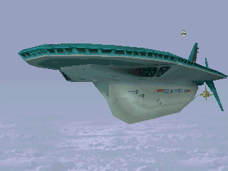

# Dash2 攻略书

> [过场 CG 剧情动画（含翻译）](https://www.bilibili.com/video/BV1Vt411Z7To/)

------

- [系统 Syetem](./01_system.md)
- [武器 Weapon](./02_weapon.md)
- [敌人 Enemy](./03_enemy.md)
- [地图 Map](./04_map.md)
- [任务 Mission](./05_mission.md)
- [子任务 SubMission](./06_sub_mission.md)
- [道具&数据 Item&Data](./07_item_data.md)
- [秘密任务 Secret](./08_secret.md)
- [A级执照 A-License](./09_A_license.md)
- [S级执照 S-License](./10_fun.md)
- [娱乐 Fun](./11_fun.md)
- [漏洞 Bug](./12_bug.md)

------

在遥远的未来，地球上大部分的陆地都已被海水吞没

忘却了过去的文明，而向未知的未来前进时，人们各自在仅存的大陆上发展独自的文明，过着新的生活

维持人们生活的，是一群被称为「寻宝者」的人

这些寻宝者是发掘古文明遗迹，并从其中采集所谓的能源矿。也就是说，倘若没有寻宝者，人类文明也就不复存在

洛克与萝露以寻宝者为职业，为了追寻传说中的「庞大的遗产」之谜，而在世界各地旅行

同时，他们也希望能够在旅程中与萝露失踪的双亲重逢
被众多寻宝者视为毕生目标的传说─「庞大的遗产」

实际上并没有任何人知道其内容为何，但他们一致同意，其中隐含无限的全新能量之理论

资产家威尔那‧冯‧谬拉是最早提倡这个理论的人物

因为他已注意到能源矿逐渐枯竭，便转移眼光到这个传说之上

为了全人类的未来，因此展开庞大空前的计划
有关于「庞大的遗产」这个传说，是前人未曾发觉的领域

谬拉耗尽自身全部的资产建造了巨大的飞行船─塞尔法飞行船，航向「禁断之地」

在船内发表记者会之时，出现了一位女性

她留下了「接近庞大的遗产者，灾难将至」的不祥预言，并带领了一群守关者出现

寻求庞大的遗产的冒险，就此展开......

------

- 塞尔法飞行船─伯爵号"サルフアーボトム"
- 全长：235M
- 全高：120M（含垂直尾翼）
- 最高速度：980km/hr（D 机关最大出力时）
- 武装：
    - 80mm 对空巴尔干炮20门
    - 对舰 D 炮 1 门、扩散 D 炮 4 门
    - 迫击战斗机 18 架

