# 系统 Syetem

------

## 基本说明

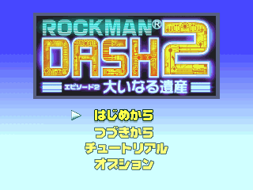

标题画面，分别是
- 开始游戏
- 读取进度
- 教学示范
- 设定

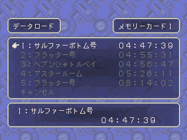

读取进度一览：有2个记忆卡可用，各5个字段

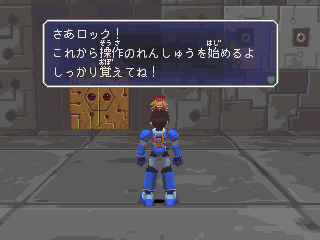

教学示范：学习基本操作

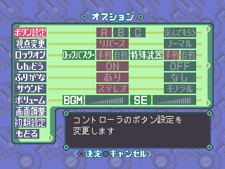

设定画面一览

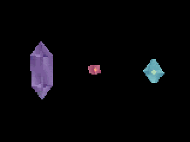

左边的是能源矿
- 有大小之分，取得越大的钱越多
- 中间的是能量素，具有恢复洛克生命力的效果
- 右边的是本代新增的特武回复体
- 具有恢复特武计量表的效果(蓝色棒，不是绿色棒)

## 战斗系统

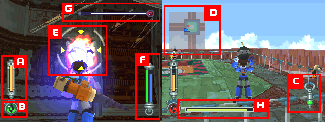

A.生命量表
- 洛克目前的生命值。使用不同的道具的话，可使量表回复或增大
- 若量表降为0且再被攻击则游戏结束
- 刚开始只有5格，可买容量包到上限10格

B.警示灯
- 洛克周围出现敌人时，此灯就会变红并发出警报声

C.锁定棒
- 当锁定对象时，此量表就会显示被锁定的对象位置供玩家参考
- 在城镇找NPC时也可派上用场
- 上下左右四个三角形会有红黄色变换，是告诉玩家现在洛克能源炮的射程是否能够打到敌人
- (至于特武射程，它不会去算)

D.地图
- 自动绘图之后在此处显示主角周遭的地形图
- 在角色状态画面可以看到地区全图

E.锁定标示
- 当锁定目标物之时，此锁定标示便会显示在画面中

F.特武计量表
- 蓝色棒表示所有的特武能源，左方的绿色棒为正在使用中的能源
- 绿色棒消耗后会由蓝色棒慢慢补充

G.头目生命棒
- 表示头目的生命值

H.我方其他设施生命量表
- 其他重要设施的生命值，为0时视为任务失败

## 状态栏

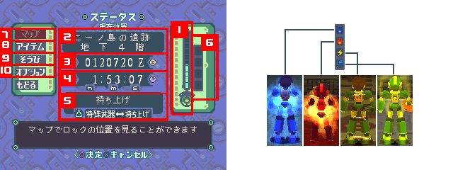

1.生命量表
- 洛克目前的生命值

2.现在位置
- 洛克目前的位置以及地域名称

3.持有金额
- 现在所拥有的金钱

4.游戏时间
-从游戏开始到目前所花的时间

5.特殊武器
- 表示洛克目前装备的特武
- 在这可按特武攻击键直接切换，非常方便

6.特殊伤害标示
- 受到特殊伤害时，此标示就会出现

7.地图
- 进入地图画面确认目前所在位置

8.道具
- 看看已取得的道具与其用途

9.装备
- 特武、身体装备、洛克能源炮更换等等

10.设定
- 一些设定，设定得好可让游玩时更为得心应手

右边的图是特殊伤害情况，由左至右分别为：

- 冻伤(生命等速下降)
- 炎伤(生命等速下降，若泡在岩浆里更快)
- 秀斗(移动力降低)
- 能源短缺(能源炮射程变0、使用特武时能量急遽消失)
- 藉由各种动作可以将异常状态快速解除
- 某些道具可以让洛克避免这些状况的发生

## 地图与道具

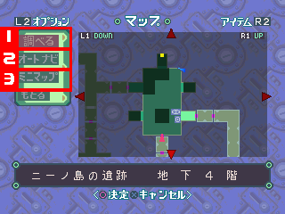

1.调查
- 首先利用箭头键在地图上移动光标，此时，现在位置以蓝色箭头表示
- 当出现一个以上的楼层时，可用切换
- 按特武攻击键为回到自己的位置，攻击为加快卷动速度
- (遇到多重楼层时，PS版可按L1、R1变换楼层，PC版不知道怎么弄...)

2.自动导向(限遗迹以外的区域)
- 设定目的地以后，在游戏中就会出现导向箭头
- 怕迷路可利用此功能

3.迷你地图
- 将游戏中的迷你地图的显示调为打开或关闭

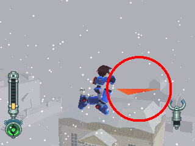

这就是自动导向功能

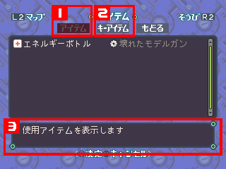

1.一般道具
- 显示白色文字的道具，按下调查钮即可使用
- 灰色文字则是别有他用
- 可自行回复、交给萝露改造、或是拿到商店卖掉

2.关键道具
- 无法直接使用，依剧情的进展而自动使用

3.说明窗口
- 说明光标移动到的道具的用途以及内容为何

## 装备

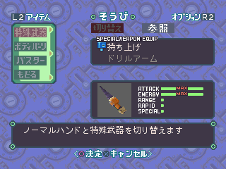

特殊武器：
- 切换─决定切换成特武或举起
- 对照─看看自己已取得的特武情报

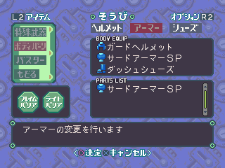

身体零件：
- 头盔─配备头盔，变得不容易倒下
- 装甲─增强防御力或是更不容易倒下
- 鞋子─在攻略不同的关卡中需随时变更，可以说是身体零件中最精华的部分

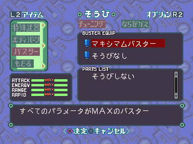
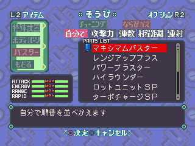

洛克能源炮：
- 调整能源炮的攻击、能量、射程、连射等
- 另外在「排序」中可依喜好调整装备，以节省换装备的时间

## 设定

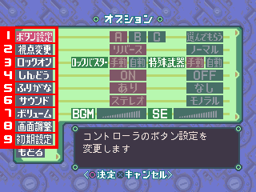

1.按钮设定
- 可以变更为A、B、C或自己设定按钮

2.视点变更
- 反转：箭头键的上为下、下为上
- 一般：箭头键的上为上、下为下

3.锁定位置
- 将洛克能源炮或特武的锁定机能改为手动或自动

4.震动
- 如果你的游戏杆支持震动，这个设定才有意义

5.音效
- 原设定有STEREO和MONO，你的音效设备必须有支持才行

6.音量
- 调整音乐与音效的大小

7.画面调整
- 在PS中是调整窗口位置
- PC中是调整显示适配器、画面大小、窗口模式或全屏幕

8.初期设定
- 一切回复到原设定，没事不要乱按

## 支援系统

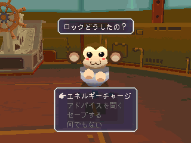

达它部分，由上至下分别是
- 补充生命与特武能源(只补充蓝色棒)
- 各种情报
- 存档
- 没事

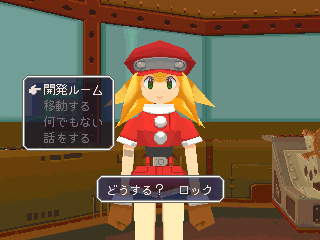

萝露部分，由上至下分别是
- 开发室
- 移动
- 交谈
- 没事

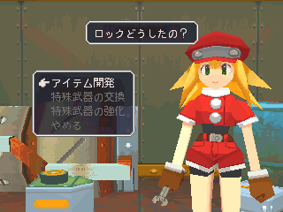

- 开发室是道具与特武的开发，交换

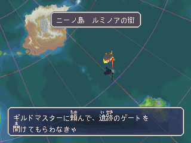

- 移动是指移动福雷德号
- 按下攻击可让飞行速度加快

## 特殊技巧

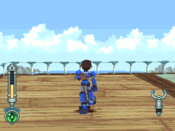

缓移
- 按住调查键不放后移动，微调自己的位置用

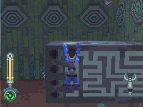

攀爬
- 当遇上无法用跳跃前往的断落地带时
- 可以利用攀爬的方式前往
- 首先将洛克移动到要攀爬之处
- 再利用上下键决定要爬上去还是跳下来

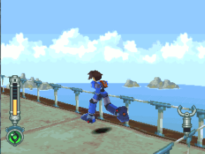

快速回转
- 当洛克进行左右侧移、后移时按下调查键
- 就可以决定正面对的方向

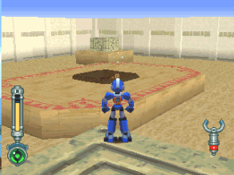

锁定
- 当使用锁定时，就会锁定前方最靠近自己的对象
- 锁定中将会一直看着对方不放，其他动作仍可进行
- 像图中这个黑心商人，用锁定马上就找到了~
- (比起一代，本代锁定强化非常多，需善用)

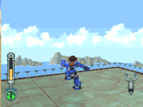

冲刺
- 取得冲刺鞋后
- 按着调查键不放便可进行高速移动
- 可以用方向与旋转键进行加减速
- 左右侧冲和左右回转
- 另外，本代在冲到落差处时会进行跳跃

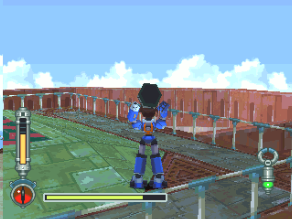

举起
- 当不装备特武时便为举起指令
- 可抓住特定物件举起后投掷
- 有时可能比特武更好用
- 是本代非常强的技巧，请务必活用

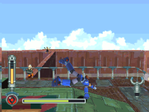

翻滚
- 按下旋转键同时按跳跃
- 便可进行侧翻滚闪避敌人的攻击
- 回避率高，但动作结束后会有小破绽，请注意
- (按下左右箭头键可以取代旋转键进行翻滚，这是本代追加的设定，一代没有)

## PC 版功能键

- F1：MEMU
- F9：回主画面(游戏中) / 跳出游戏(主画面中)

## 关于 PSP 版

1.画面变成16:9，可在设定上改回4:3
- 人物没有被拉宽，仅视角变宽，但也因此在剧情上会发现到以前没有的穿帮画面
- 但是2D接口就直接被拉宽了
- 另外，使用光盾时，防护罩的最外围特效也会跟着一起被拉宽...

2.剧情追加字幕，可在设定中关闭

3.因为PSP没有L2、R2键，所以锁定目标按法变成L+R键一起按

4.部份的音乐播放速度有变慢的状况，但跟DASH1相比倒还好

5.起始界面追加『多蓉与哥布』游戏中附送的『DASH2 EPISODE 1』的数据片，可以无条件直接玩

6.游戏中开始键、选择键的功用改变
- 在PS版中，开始键是暂停游戏功能、选择键是开启主接口
- 不过PSP版改成与DASH1相同：开始键是开启主接口、选择键是开启地图数据

7.与其他厂商的置入性营销移除：汉字检定
- 这个其实是与『日本汉字能力检定协会』合作的项目，游戏中的题目其实就是当时检定考试的题库
- 不过PSP版就变成机智问答了，连带房间的布置也有改变
- PS版会有『汉检』的表框，墙壁上也隐约看得到汉检的字
- PSP版就变成普通的挂画了，墙壁上也没有字

8.在水中的行动速度，PSP版有比较快一点，被敌人打飞也不会漂半天

9.哥布寄的第一封信内容改变，主要是提到新制作的哥布
- PS版在信中会明确提到是42号的讯息
- PSP版就没明讲

10.特武开发费用变更
- 大部分是削减金额的状况，且跟PS版相比削减量还不少
- 但有少部分是增加金额的状况
- 详细可以参阅这边的[网页数据](http://rockmandash.nomaki.jp/dash2/weapon_psp.html)

11.PS版破关时，播放ED曲时会同时显示的玩家投稿图画，在PSP版被全部删除了

