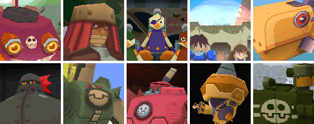
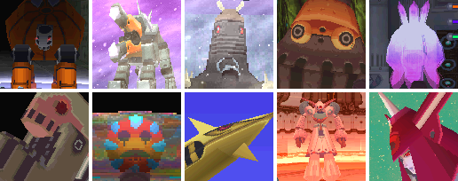

# 敌人 Enemy

------

## BOSS - Air Pirates（空贼团）

- [亚库多‧克拉贝‧改 = ヤクト．クラベ改 = Yakuto Krabbe Revision]()
- [波拉 = ボーラ BOLA]()
- [Nino Island Mission]()
- [Carlbania Island Mission]()
- [王者克劳顿号 = キンググライドン = King Glydon]()
- [庞克司卡斯 = バンコスカス = BANCOSCUS]()
- [Saul Kada Island Mission]()
- [火焰型古斯塔夫 = ホバーグスタフ = Hover Gustaff]()
- [钻头彭 = ドリル‧ボン = Drill Bon盖玛因夏夫特 = ゲマインシャフト = Gemeinschaft]()
- [盖玛因夏夫特 = ゲマインシャフト = Gemeinschaft]()

## BOSS - Reaverbots（守护者）

- [巨汉机械王 = ジャイワン = Giwan]()
- [俄耳兽 = オルフォン = Wolfon]()
- [长毛象 = ラシマンムー = Rush Mammoo]()
- [丰兵械蛙 = ガルガルフンミー = Galgalfummi]()
- [米德思 = ミドス = Midosu]()
- [Saul Kada Ruins Mission]()
- [Calinca Ruins Mission]()
- [纪吉 = ジジ = JIJI]()
- [赛拉战斗终端机 = セラ战斗端末= SEAR BATTLE COMPUTER]()
- [赛拉战斗终端机最终形态 = セラ战斗端末最终形态= SEAR BATTLE COMPUTER FINAL MODE]()

