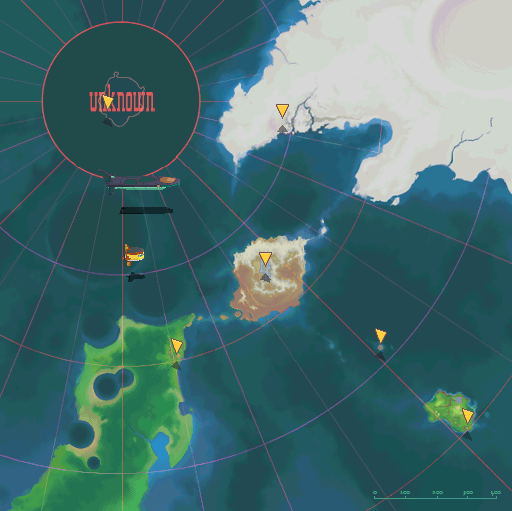

# 地图 Map

------

- 世界地图共有 8 个区域可点选，鼠标变成手指代表可进入
- 区域地图内若有横向手指，表示可点选

- 福雷德号
- 塞尔法飞行船
- 禁断之地
- 高岭大陆
- 杨绍卡废坑
- 高岭大陆遗迹
- 曼德岛
- 曼德岛遗迹
- B级波古德遗迹
- 尼诺岛
- 尼诺岛遗迹
- 基路度遗迹
- 喀尔巴尼亚岛
- A级畿豆遗迹
- 天堂‧宇宙飞船储物舱 / 防卫区域
- 天堂‧边际地带
- 天堂‧领袖之厅
- 萨尔‧卡答岛
- 萨尔‧卡答岛遗迹
- S级基摩多玛遗迹
