# A级执照 A-License

------

关于执照考试，关键就在于「举起」与「锁定」这二项能力！

把守关者抓起来，一直丢丢丢，这是基本常识；

不过，还有「环形平移」与「极限爆击」呢！
 
> [FUN](./11_fun.md) 页有解说

目前挑战极速纪录：残时 `01:43:46`

影片参考：

[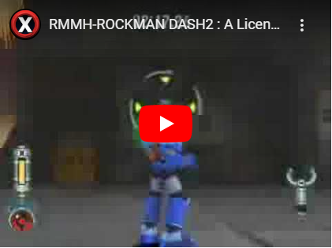](https://www.bilibili.com/video/BV1SRruYHERG)

<!-- 视频来源： https://www.youtube.com/watch?v=iw5ISdO-Hnc -->

## 考试地图 1

守关者：

- 回旋轮 X 2
- 蚯蚓兵 X 1
- 戈尔护卫 X 1

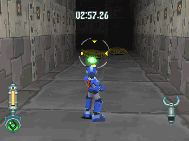

- 先使用锁定，攻击较近的那个回旋轮
- 诱使他前来后举起(要确定二个回旋轮距离够远)
- 砸另一个回旋轮(此时不要用锁定，因可能会锁定到蚯蚓兵)

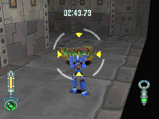

解决蚯蚓兵最快的方法

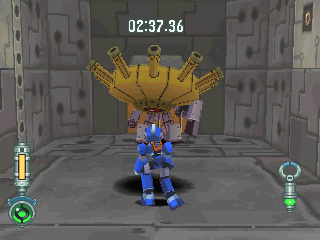

把没死的回旋轮拿去砸戈尔护卫

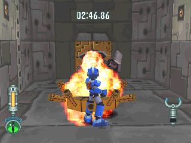

打戈尔护卫时，是要等他旋转个一圈后再攻击才有效

> 正常来说，这只二发就可解决

## 考试地图 2

守关者：蚯蚓兵 X 4

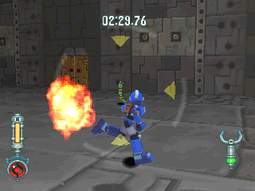

没什么...不要被碰到就好

## 考试地图 3

守关者：戈尔护卫 X 2

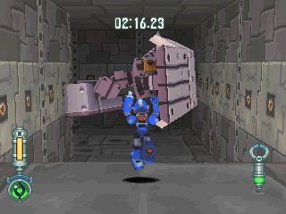

直接跳到平台上，等他解除防御后马上冲过去抓起

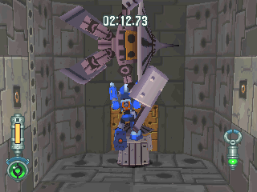

- 跳起来丢，这样成功率比较高
- 跑跳过去比较危险(影片内是用跑跳)，但是比较省时
- 第二种方法是在他的射程以外，在定点跳后再投

## 考试地图 4

守关者：

- 回旋轮 X 2
- 密陀僧 X 4

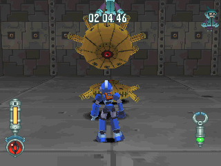

马上举起眼前的回旋轮，砸较后面那个(动作要快！)

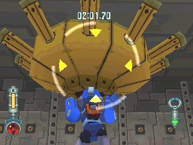

把未死的回旋轮拿去砸最近的密陀僧（虽然会受伤，但是也比较快）

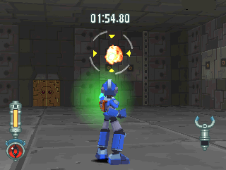

站远点慢慢解决吧~

> 只要不跳起来，密陀僧就不会发现

## 考试地图 5

守关者：

- 蚯蚓兵 X 2
- 阿米斯战队 X 1

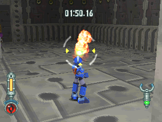

先解决二侧的蚯蚓兵

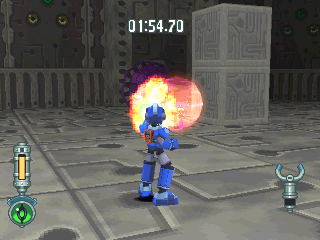

定母机，以极限爆击解决！

## 考试地图 6

守关者：夏尔库鲁司 X 1

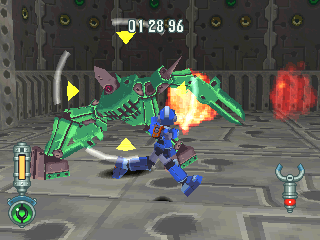

- 进房间后马上锁定，往右移动
- 夏尔库鲁司冲过来后，一直用环形平移就赢定了

