# S级执照 S-License

------

关于执照考试，关键就在于「举起」与「锁定」这二项能力！

把守关者抓起来，一直丢丢丢，这是基本常识；

不过，还有「环形平移」与「极限爆击」呢！
 
> [FUN](./11_fun.md) 页有解说

目前挑战极速纪录：残时 `02:47:90`

影片参考：

[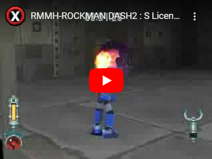](https://www.bilibili.com/video/BV1DXruYXEao)

<!-- 视频来源： https://www.youtube.com/watch?v=ncpV2CTPJ7o -->

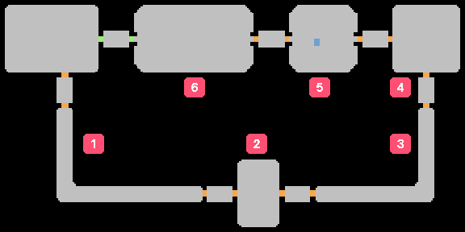

## 考试地图 1

守关者：

- 回旋轮 X 2
- 密陀僧 X 6
- 戈尔护卫 X 2

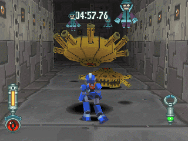

直接走过去抓较近的回旋轮，砸另一个

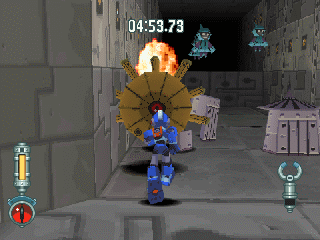

再抓起没死的那个回旋轮砸左边的戈尔护卫，注意：

- 不要太右边，否则二个戈尔护卫都会发现你
- 要注意角度问题，不然回旋轮会撞到转角而往右弹飞

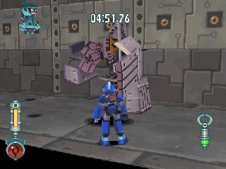

左边的戈尔护卫尚未复原时抓起砸右边的，此时右边的戈尔护卫仍没反应呢，砸下去吧

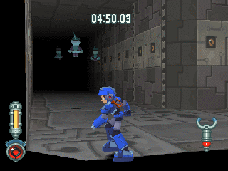

最后在转角处用锁定解决六个密陀僧

> 先解决左方再解决右方

## 考试地图 2

守关者：

- 蚯蚓兵 X 4
- 阿米斯战队 X 1

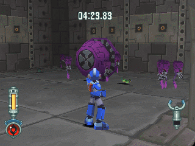

解决一部分的蚯蚓兵后，瞄准好角度对阿米斯战队攻击(不用锁定较省时)

使用极限爆击吧！要一边解决子机一边打本体，还是本体打爆再清子机就随便了(个人建议后者)

## 考试地图 3

守关者：

- 戈尔护卫 X 1
- 密陀僧 X 1
- 回旋轮 X 2
- 鲍佧浮蝣(蝶) X 2

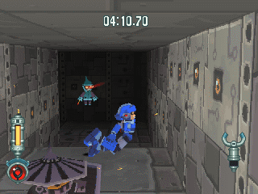

直接跳过去撞戈尔护卫，被撞倒后，等密陀僧靠近后再去抓戈尔护卫(为了让他自爆)

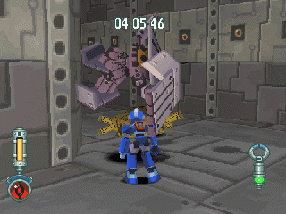

砸回旋轮，这时戈尔护卫会爆掉。

回旋轮没反应，马上抓起之！砸另一只回旋轮

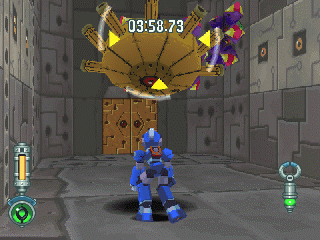

最后一只回旋轮拿去砸鲍佧浮蝣(蝶)，残存的以极限爆击解决之

> 要注意第一只可能没有被打死，多给几炮吧

## 考试地图 4

守关者：阿米斯战队 X 3

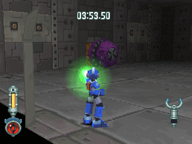

1. 建议先打左边，完全不理会子机。
2. 直到快躲不过子机时，再以顺时针方式一个个打母机。
3. 快被撞到 `→` 攻击另一侧的母机
4. 重复「第 3 步」N 遍（顺时针向方式将母机消灭，还有记得极限爆击）

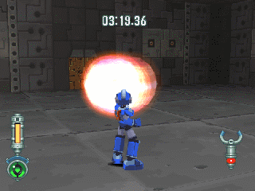

若顺利，则子机最后会黏得很密，本来要好几十发才能扫除的难缠子机，现在五发左右即可解决

> 子机们的壮烈悲鸣

## 考试地图 5

守关者：密陀僧 X 6、戈尔护卫 X 2

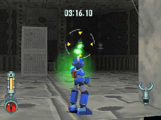

这个密陀僧是此区成败的关键，非先解决不可：

- 进门后先往右小转一下即可直接锁定到他
- 解决右方二个比较近的后，清除左方全密陀僧
- 最后再清掉右方余下的一只

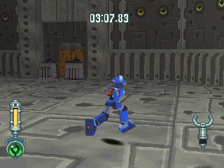

用先斜右走再斜左走的方式接近戈尔护卫
> 千万不要走中间！

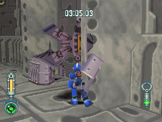

这里有个小秘诀，看到图中洛克旁边有柱子吧？

- 一边黏着柱子往前， 一边按住举起不放冲向前
- 戈尔护卫来不及解除防御就被抓起了！
- 并且另一端的没反应 (这是成功例子，真的很简单)

## 考试地图 6

守关者：夏尔库鲁斯 X 2

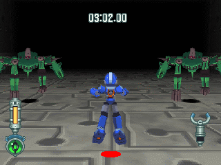

这区要快速过关蛮困难的，在此介绍的是个人发现到的快速过法：

- 首先，先直走
- 到红点后进行大跳跃

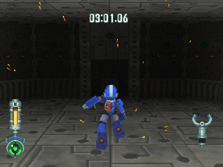

- 跳到最高点后往右小转一下
- 接着会被撞到

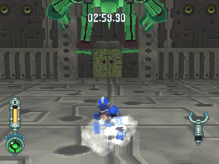

然后，会发现他们跳过来，而且身体重迭了起来！(几乎可以视为一只)

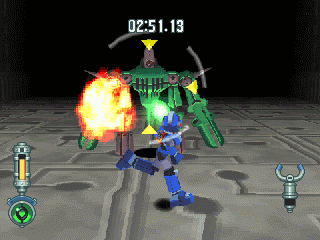

最后用环形平移与极限爆击解决

> 由于可以同时打到二者，省了不少时间

------

补充:

- 往右小转是因为这样子的话，洛克被撞到后比较不会偏掉(不知道为什么，若不往右小转的话会偏左飞出去)
- 如果偏掉的情况很小，则他们身体重迭的机率很高
- 若偏掉的话，则有可能连跳过来都没有(会往别处跳走)
- 一开始没跳好也很难让他们身体重迭
