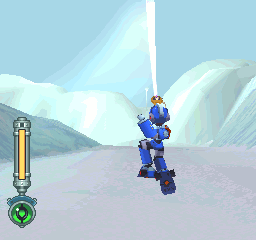
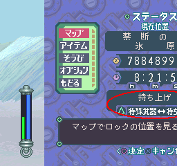
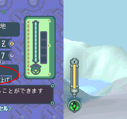
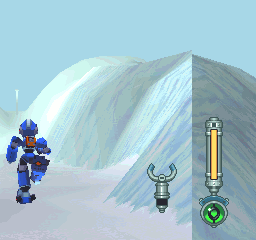
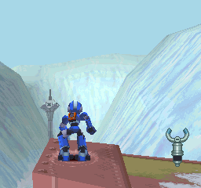

# 光束剑的秘密（浮空技）

------

示范的地点在禁断之地中，与中头目对战的那个地方(刚进入)

因为这里落差够大，可以浮空得很爽 XD ~

就是此时！二段目！

马上！状态区！按下特武键切换特武！

啊哈！浮空啦！

跳上来了！

这是在右上那张图之后
往前方电杆跳之后的情况(动不了了...)

------

一些动作会取消浮空：像是跳、翻滚、光束剑的再度使用...

其实浮空技的应用不可能只有表演性质，像是在尼诺岛(水迷宫)遗迹中，那些落差很大的地方可用浮空技来玩玩。

这里有个[演示视频](https://www.youtube.com/watch?v=cGe3V-iRy5Y)，可以轻松打倒最终头目 XD
