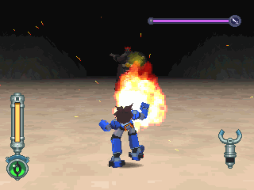
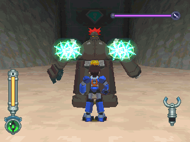
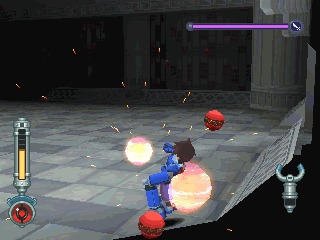
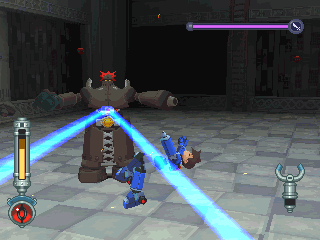
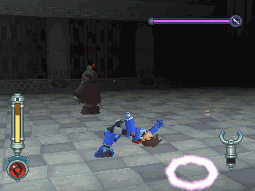
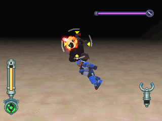
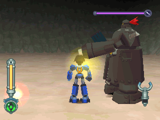

# 庞克司卡斯 = バンコスカス = BANCOSCUS

------

## 敌方资料

身高 230 公分，现年 40 岁的空贼，BB 兄弟的另一人。

在厚重的盔甲中储放了多种武器，因而动作缓慢。

兴趣是享受自己口袋中塞满钱的快感。

## 攻击模式

### PART 1

机枪击：大略朝洛克位置发射

从肩部放出四个追踪光弹：不过速度很慢(第二次对决时不会用)

### PART 2

从肩部放出巨大弹：在房间四处漂，接到指令后才冲向洛克。

腰部的雷射装置：建议用翻滚(跳起来反而会被扫到)

光盘：攻击力为最强，但是也很好躲 (这招很像气圆斩...)

## 攻略说明

不管哪一次战斗，都可用环形平移应对！

设计不良...？

只要离他很近，机枪击就打不到你

