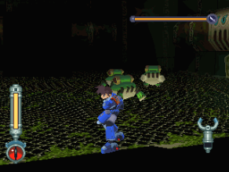
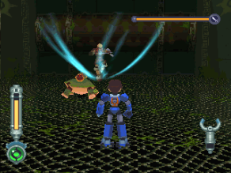
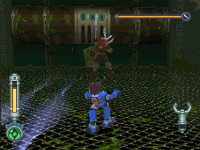
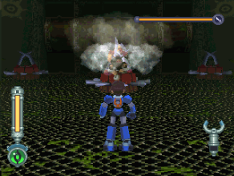
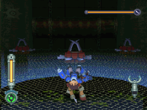
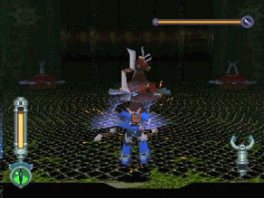
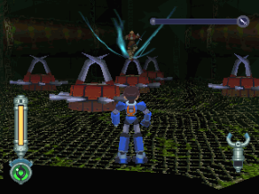
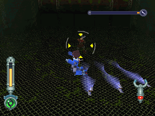
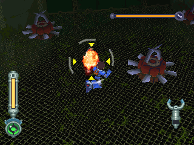

# 波拉 = ボーラ BOLA

------

## 敵方資料

極惡空賊BB兄弟中據稱較年輕者
與龐克斯卡司搭擋19年
擅於各種忍術，但最近因為身體已負荷不了而淡出空賊界

## 攻擊模式

## 攻略說明

PART 1

因為手裡劍攻擊範圍廣
建議用環形平移+跳

彈跳蛙並不難對付
除非玩家刻意，否則看到被強化的機率很低

PART 2

這次手裡劍攻擊範圍較窄
不過因為機關的關係
還是建議用環形平移+跳

波拉粉廢...被環形平移玩死的典型
只要了解招式，他就沒戲唱了