# Calinca Ruins Mission

------

## 任务说明

本任务是要抓名为「韩盖卡尔锁兵」的敌人，不然进不去放有封印之钥的房间。

## MISSION

盖卡尔锁兵 = ハンゲカル = Hangekal

高岭大陆遗迹里出现的钥匙型守关者。

它们其实正是通往封印之钥房间所需的钥匙，不会攻击，但是警觉性很高，跑的速度非常快而不易捕捉。

似乎彼此能用特别的方法联系，只要一只被吓到其它也会乱跑。

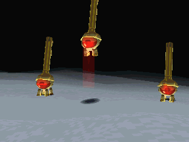

我们就是要抓这三个小家伙！

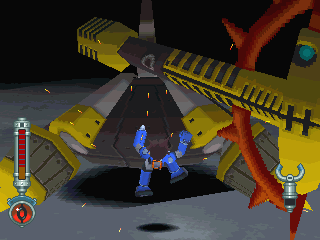

房间中心的加佛炮兵是最大的威胁，要先解决。

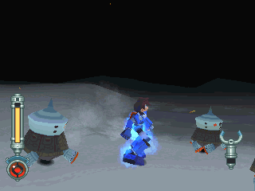

小心冰霍洛钢的偷袭，被撞到会附带冰伤。

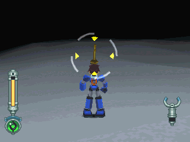

不要攻击，绕到后面再伺机而动。

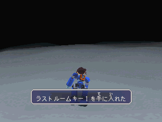

按着「抓取」键冲过去就可取得了！

## BOSS PART 1

琳浮玛琪 = リンブルメンジ = Rimblemenji

在 DASH2 登场，高岭大陆遗迹的头目守关者，有着胶状的无机质躯体和核心。

原本是不具攻击性，但在感应到封印之键被夺取时会巨大化并攻击入侵者。

有着令人感到意外的超高速度(直线跑的话，他可以比洛克还快)。

因为是软件守关者的关系，可以作出许多匪夷所思的攻击，包括：

- 吐出胶球、快速压扁自己以攻击稍远的敌人等等
- 但是最恐怖的还是让地面充满冻气，使对手陷入冰伤状态的能力
- 在受重伤的时候会暴怒化并全力进行冲撞，在这时是无敌的

只有等到他虚脱而动弹不得的时候才能趁机攻击。

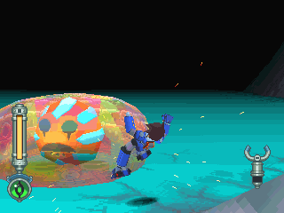

一开始并没有敌意，但是碰到时还是会受伤的喔。

把他打死也只是觉得好玩而已，并不会影响到接下来的剧情(根本没死啊)。

## BOSS PART 2

一开始要用环形平移，一边调整自己的位置。

放出地板后，要先穿钉鞋再上去(地板会滑，也不能抓)，然后 环形平移 + 跳攻击。

因为黏巴达分裂弹射速大于洛克跑步的速度，不跳起来的话，越到后期越容易被打到。

若想在地板上，那就穿防护鞋，免得冰伤得太严重。

激怒他后，就必须他虚脱时再攻击。

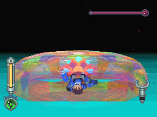

撞击：威力并不强。

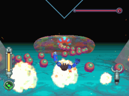

跑到门口时才会用的招式(曼陀珠？)，怪恶心的...

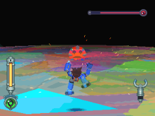

滑到中间后跳起并坠下，此时无敌状态。

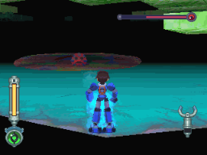

滑到中间召唤地板，跳起并坠下，坠下时会让下面的地板冻结。

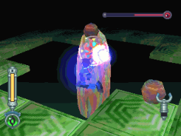

玩家跳到上面的地板时，会发动黏巴达分裂弹。

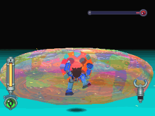

HP 半减后暴怒 (一定会，但变身时间不定)，滑行速度变快并且无敌，但是威力没有提升。

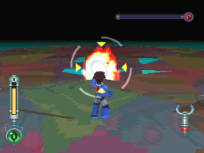

暴怒后的弱点：无法持久。

此时黏液无攻击力，打头吧！

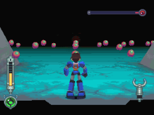

BUG ？

只要先让他暴怒，然后跑到门口，等他发动曼陀珠直到虚脱，再跑到对面的门，等他精力恢复就可看到

