# Carlbania Island Mission

------

## 任务说明

本战要潜入喀尔巴尼亚岛的葛来德要塞，共 6 个部分。

每过一个部分后可以调头奏之前的门回到要塞外面找达它储存。

> 除了要跳进窗口的那一部分，因为这里即使打倒全部的敌人，下次再来时会再生

## PART 1

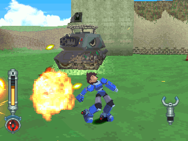

在猛烈炮火下努力求生。

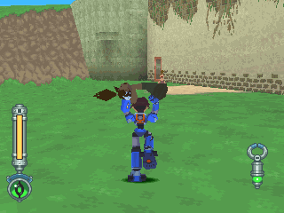

如果有人变成焦炭，把他抬起来。

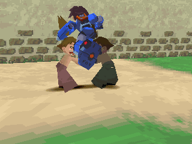

要跳到手上能继续剧情。

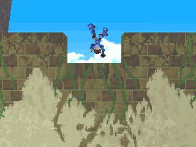

潜入成功！

## PART 2

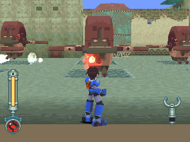

先将尚未起飞的打倒，免得麻烦。

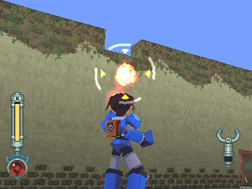

然后，把机关炮全打掉。

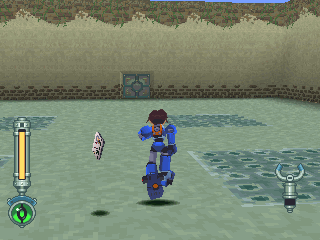

最后解决全部的敌人，捡起卡片。

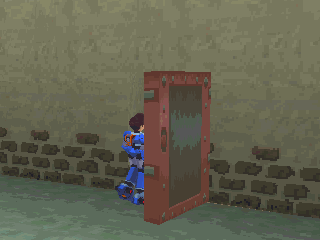

如果觉得体力不支，随时可烙跑(之后也可以)。

找达它补给纪录，整装齐备再出发。

## PART 3

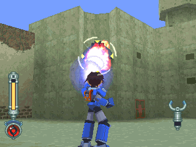

先解决两侧的炮。

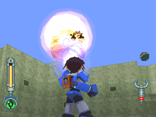

向碉堡攻击！(射程不够长是不行的)

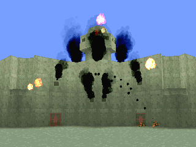

碉堡破坏！内有好东西，别错过。

另外别忘了卡片钥匙。

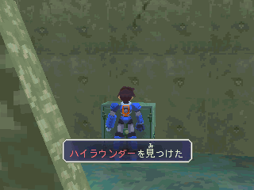

- 保险箱：强巡逻者(飞弹装备)
- 冰箱：最好吃的鸡肉

## PART 4

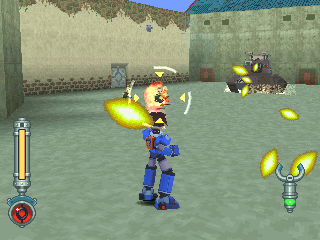

先解决鸟霸。

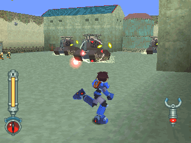

把战车毁掉，不要理墙壁上的机关炮。

接着捡卡片钥匙。

## PART 5

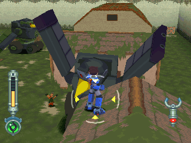

这机器人会乱丢箱子，打掉吧！

另外可利用制高点，不过房子耐久不高。

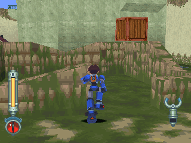

接着要把箱子迭起来，以进入窗户。

正规过法是把两个箱子迭起来，另外也可以像图中这样丢在墙壁上，然后用冲刺的跳跃能力上去。

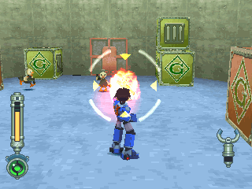

这家伙以为他是谁，居然想打倒我 ？！

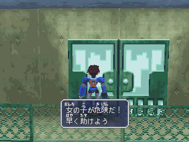

这里是屋顶，看来不能烙跑啊...

## PART 6

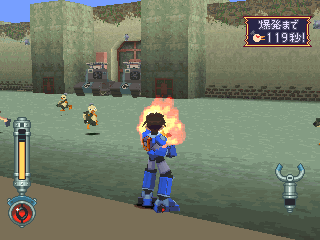

敌方进行了自爆计划！要在 120 秒内脱出！

先解决鸟霸。

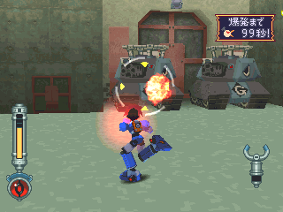

至少要打爆一个战车才有成功的可能。

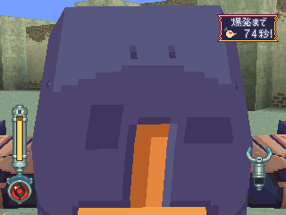

动作若不够快，克劳顿舰艇也会来烦。

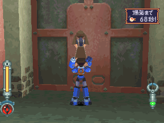

将优抓起后冲向门就过关了。

