# 钻头彭 = ドリル‧ボン = Drill Bon

------

## 敌方资料

为了耐热而设计出来的装甲。

即使如此，若掉到岩浆里还是会受伤。

## 攻击模式

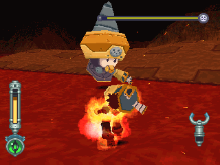

金刚飞拳：只要攻击他就会用这招，会一直追踪洛克，可以锁定并打掉。

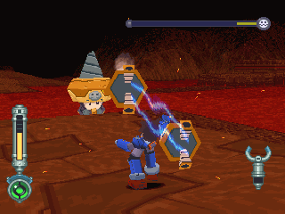

HEAVEN & HELL(勇者王GAOGAIGAR？？？)

HP半减后使用，跟上一个招式类似，只是变成双手一起发。

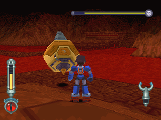

打出拳头后将自己缩在壳内，不过攻击仍是有效的。

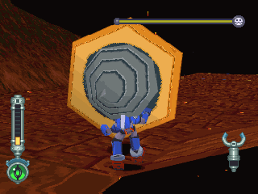

钻头攻击：将自身旋转，朝洛克高速突进！！

多半在打出飞拳，且被玩家马上打掉飞拳后使出，不过在使完后会气绝一段时间(头晕？)

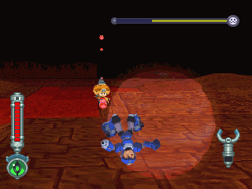

拋物线丢出爆弹朝洛克攻击：当比彭早到终点时，彭才会使用的招式

## 攻略说明

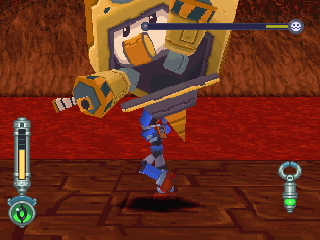

用力将彭扛起，丢向岩浆！！！

> 老实说，只用举起就能玩死他

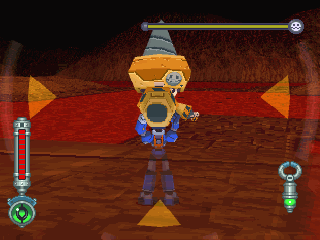

飞拳可以抓住！丢回去吧！

> 至于双手版，不行

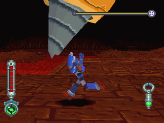

当使出钻头攻击时，也可以举起喔。

不要正对面抓，绕到他侧边再抓较容易成功。

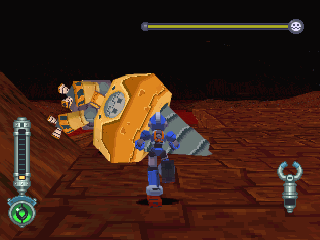

趁彭气绝时光明正大地靠近，将他举起！

## 拾取封印之钥任务

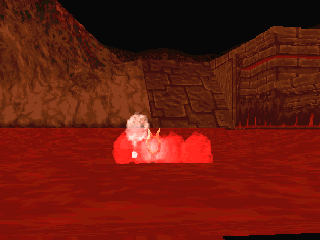

这是不小心让彭逃走后的剧情。

彭很高兴地拿着封印之钥，却手滑使之掉到岩浆里去了...

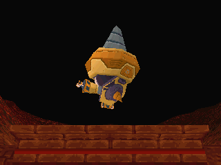

因为怕岩浆所以跑了...

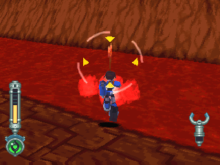

封印之钥会在一定的地点出现。

建议用锁定，且不要跑来跑去。

先看好其出现地点是哪几个地方，然后守株待兔，距离够近后再冲过去。

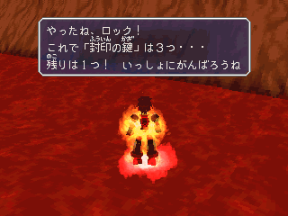

就算炎伤也没关系，毕竟房间内没有任何敌人，只要拿到就可以过关了。

