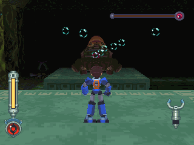
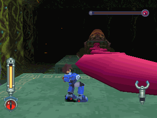
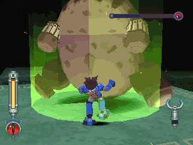
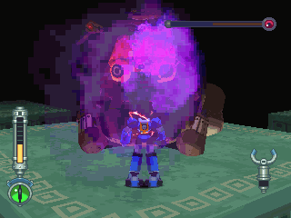
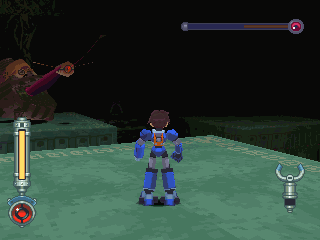
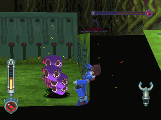
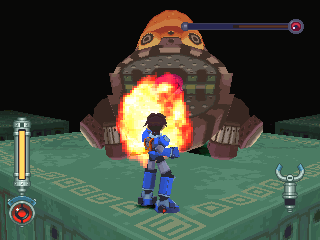
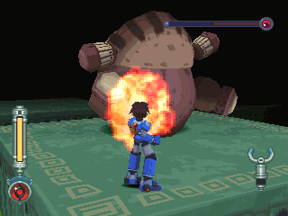
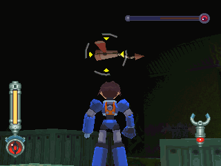

# 丰兵械蛙 = ガルガルフンミー = Galgalfummi

------

## 敌方资料

DASH2 中在曼达岛遗迹中登场的头目级守关者，是大型的青蛙模样，守护着藏在遗迹中的封印之钥。

它会不停吐出泡泡攻击，巨大的舌鞭也是强力技之一，不过可能是有点老旧了，在大跳跃时会有意外翻过身来的状况。

弱点隐藏在口中，也因此在它张嘴攻击的时候能够反击。

在与它对战的地方还会出现两种颇为稀有的喽啰守关者：

- 一种是蚊虫型的バルフラー(阀路浮虫)
- 另一种是オタマーン(渥太电鳗)

在体力不足时，它偶尔也会伸出舌头卷食阀路浮虫来回复体力。

## 攻击模式

吐气泡：有追踪能力，速度不快，可打掉。

舌鞭：共有垂直、平行、大扫动三种模式，其中又以大扫动威胁最高。

以跳跃的方式在四个平台间移动：有时会跳失败，但伴随着冲击波。

麻痹毒素：与他在同一个平台时才会使出。

生命降到一定程度时，就会捕食天上的阀路浮虫，回复约 `1/10` 的 HP (很贼喔)

尽量不要在下面，被一群渥太电鳗围攻的话非常危险。

即使被打倒也会再生，而且无法锁定(？？？)

## 攻略说明

在房间的边有着大型的圆刃机关，那是波拉设计的。

如果一直站在房间边边不动的话，丰兵械蛙不会理人 XD ~

个人喜欢近攻战，就算被麻痹或被舌鞭打到也没关系。

下面的渥太电鳗相当可怕，体力高又会再生、不能锁定；还是在四个平台上乖乖的正面作战吧，多善用翻滚。

趁吐气泡以及舌头时攻击吧！

这是跳失败后才有的机会：攻击腹部！

多注意有没有阀路浮虫正飞着，被丰兵械蛙得逞就麻烦了。
