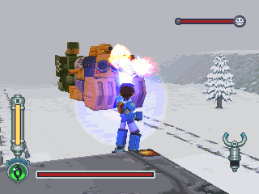
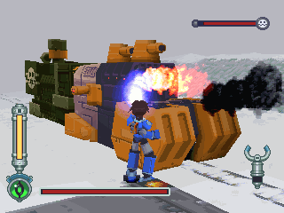
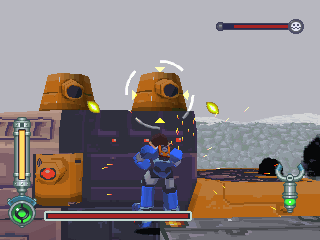
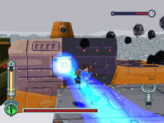
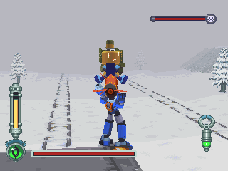
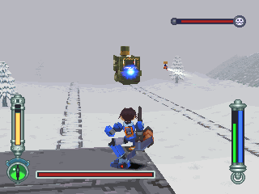
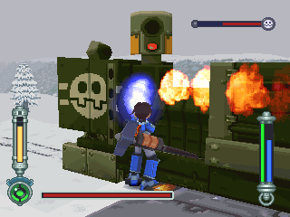
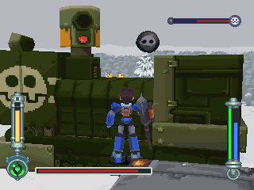
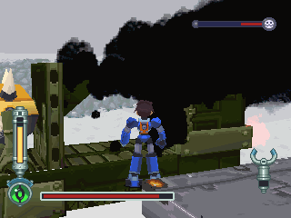

# 盖玛因夏夫特 = ゲマインシャフト = Gemeinschaft

------

## 敌方资料

在 DASH2 登场，空贼们为了袭击扬绍卡镇教会而打造的武装列车。

车体前段为彭恩家列车，后段为葛莱德家列车。

BB 兄弟评估战术后认为作战成功率太低而没有参加，为了要迎击它，萝露也开动了扬绍卡镇的火车与它追逐。

葛莱德家列车：

- 在性能上是较为优越的，但因为没有安装动力设施而被连接在彭恩家列车之后
- 除了会瞄准洛克攻击的炸弹以外，还有威力绝大的激光束
- 车体的坚固程度也远超过彭恩家
- 不过当洛克将其武器全部破坏后，嫌葛莱德家列车碍手碍脚的多蓉就切断车体连结，使葛莱德家列车出轨爆炸

彭恩家列车：

- 是由彭为动力来拉动的，在车首的地方搭载了彭恩家最有名的能源弹兵器
- 而在战斗过程中，哥布们也会投掷炸弹来攻击
- 为了对付武器射程受限的洛克，在车尾的地方有飞弹发射器，在距离较远的同时，哥布会乘着飞弹进行自杀攻击
- 不过正因为有这种自杀飞弹，反而给了洛克将飞弹丢回的机会而造成作战失败

> 命名：德语「共同体、公共的社会」

## 葛来德家

锁定最右边的炮台，如此即可将炮弹全部击破。

不要用锁定，直接攻击本体。

距离很近时才会启动炮台，所以请在距离未拉近时狂攻击本体。

在把 HP 打到一半后并且彼此距离很接近时，会启动雷射。

> 很烦，这时还是一样攻击本体就好，并且善用翻滚和跳来闪躲雷射

## 彭恩家

一开始列车距离非常远，若没有远距武器，就抓住哥步飞弹后丢过去！

但是只能抓平飞的，飞行轨道为坠下式的就不能抓。

若有已改到最长射程的加农光弹，可使用之。

并且复合使用哥步飞弹，以节省时间。

当冒烟后就不会再发动飞弹了，取而代之的是能源弹，威力很强！

用加农光弹把正在集气中的能源弹打掉吧！

不要被锁定骗了，直接攻击本体。

若看到能源弹在集气，要赶快使用锁定把集气打掉。

距离拉近后会有哥布丢炸弹，打掉他们！

进行到这也差不多了，剩下的简单了，全力攻击彭！
