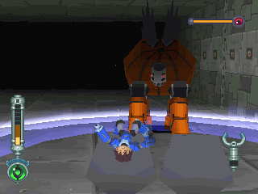
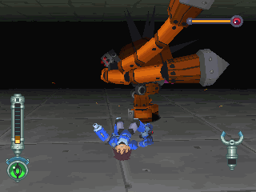
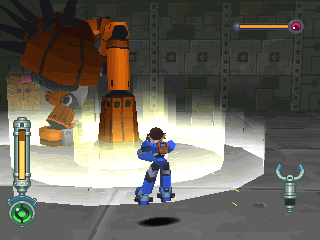
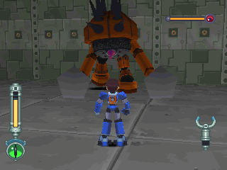
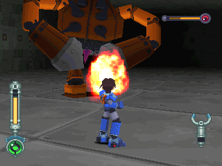

# 巨汉机械王 = ジャイワン = Giwan

------

## 敌方资料

在 DASH2 中登场的中头目级守关者，拥有一双长长的强力手臂，巨大的人型守关者。

因为手臂是连在胸前，待机的时候通常是拖在地上，在战斗的时候才会把手臂往后甩一圈再迎战。

在魁梧的背后有数根尖刺，其中连在屁股上，颜色不同而特别短的一根是它的弱点。

虽然攻击它全身都有效果，但打到此处时它会受到更重的伤害并用手抚摸屁股 XD ~

## 攻击模式

双手冲击波：最强的招式。

双手向左挥击：当在他左边时会使出。

小型冲击波：当在他右边时会使出。

## 攻略说明

第一个遇上的头目级守关者。

虽然攻击力高，但是很好躲，因为他在攻击前都会有约 `1 ~ 2` 秒的准备动作。

冲击波范围并不广，放心。

弱点设计在屁股蛮好玩的，不过解除武装这动作在他冒烟后就不能再看到了。

如果离开他的视线一段时间，他会解除武装，来回踱步。

屁股红色那一根是弱点！

他是来守关还是来搞笑的？XD ~
