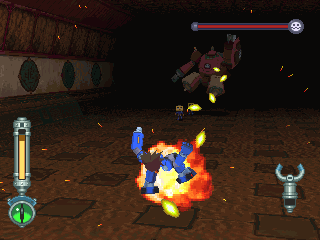
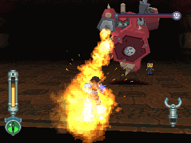
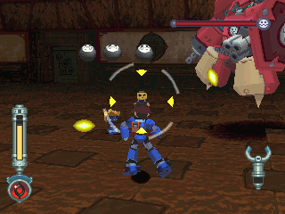
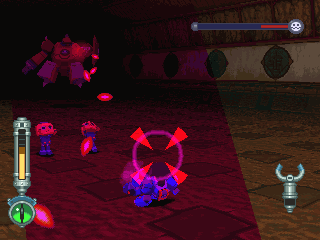
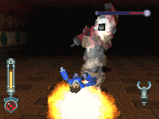
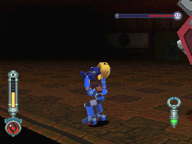

# 火焰型古斯塔夫 = ホバーグスタフ = Hover Gustaff

------

## 敌方资料

彭恩一家的兵器之一，二足步行型机器人。

在设计上采用可换装零件的设计，双手与足部都可以依照状况而切换；此外，身体的装甲以及能源筒也都是可拆卸式的。

在操作方面，除了机身一般由多蓉或提索来操作之外，必须要有一名哥布进行武器的狙击操作，拥有狙击能力的哥布能左右其武器的能力，但一般的哥布则无法运用此机能。实际上，进行狙击操作的哥布也可以操作整台机器。

在游戏中可看到的改造机型有火焰古斯塔夫(ホバーグスタフ，DASH2登场)，及古斯塔夫坦克(グスタフタンク，多蓉与哥布出场)。

么子彭的战斗用身体也是采用与古斯塔夫类似的构造。

## 攻击模式

连发机关枪：几乎没时间反击...(有盾牌挡着啊！)

火焰波浪：也是没反击的机会

哥布会朝洛克丢3颗炸弹

(这里的哥布不好惹的，打不死)

HP半减后，在远距离情况下发出指挥弹，绝对躲不过，哥布会变得很具攻击性

(玩过「多蓉与哥布」就知道为什么)

HP半减后，近距离情况下发出3发火焰弹，并且会让地板着火一段时间

(不小心碰到至少会减 `1/2` ~ `1/4` 的HP，注意！)

## 攻略说明

哥布要让他倒地后才能抓起，不过这只有娱乐用途...

一开始的机枪击以及火焰会让玩家疲于奔命，哥布虽然没什么威胁，但是撞到他会受伤！

就一直用环形平移应对吧，通常移动中才会将盾牌放下来

