# 纪吉 = ジジ = JIJI

------

## 任务说明

给人斯文的印象，为赛拉的心腹部下，同时也是卡卡的友人，并且存在着竞争对手的关系，同样拥有变形成飞行形态(金色神兽)的能力。

在禁断之地与赛拉一起出现在洛克前，被安置在赛尔法飞行号保护着。

## PART 1

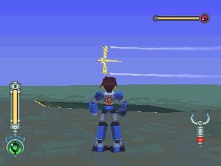

在甲板上盘旋飞行

> 有时会一直不下来，可能是 BUG，详见 [BUG](../../12_bug.md) 页 `->` 转圈圈的纪吉

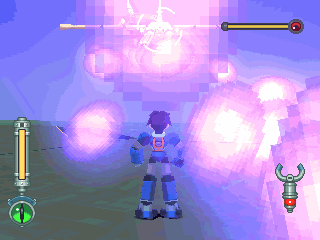

能源弹攻击：翻滚即可。

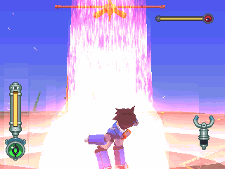

爆弹冲击波：也可以利用翻滚。

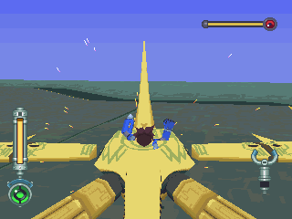

身体撞击：还是靠翻滚。

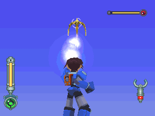

必须利用他攻击前的时候，我们才有空档可反击。

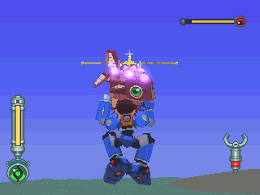

彭恩家族也来帮忙了，不过好像没用啊...(也打不下来)

## 中场

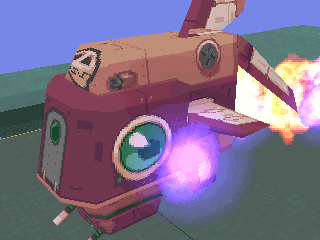

当卡卡 HP 一半以下必发动的剧情：

彭恩家族被卡卡的能源弹击中，强迫退出战斗，剩下洛克一人孤军奋战。

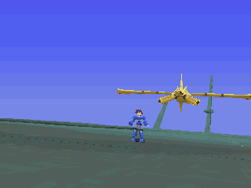

还有，若之前把卡卡的 HP 打至 `1/2` 以下的话，第二轮时仍会强制回复 HP 到 `1/2` ...(真是作弊！)

## PART 2

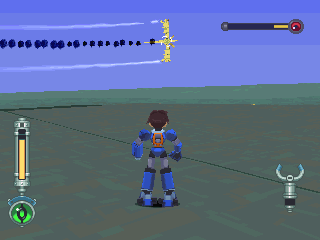

HP `1/4` 时的情况，等会儿就会迫降了。

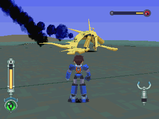

体力不支迫降了，但是不可以大意！

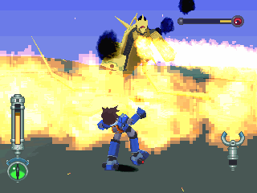

很强的火焰攻击，至少减 `1/3` 的 HP 。

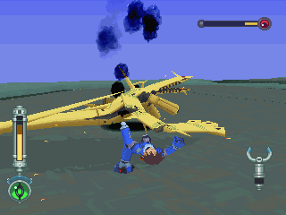

从尾端接近的情况，一样无法靠近。

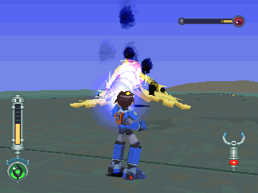

凌虐卡卡 XD ~

基本上他迫降后用远距武器就可以解决了。

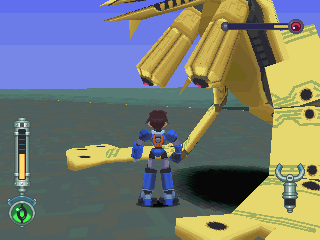

这边是安全地带，无聊的人不妨研究该如何进来 XD ~
