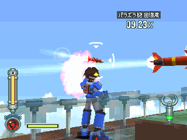
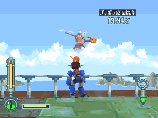
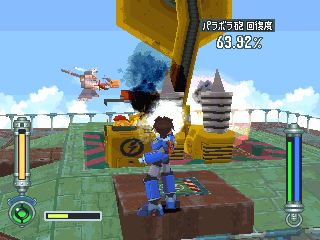
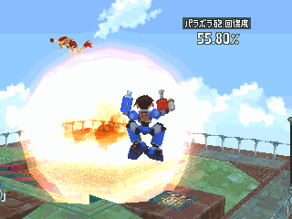

# 王者克劳顿号 = キンググライドン = King Glydon

------

## 敌方资料

葛莱德家的主力舰。

拥有超乎想象的极大火力，但是首次出战时就遭到空想兵器音波干扰炮的攻击而击坠。

## 攻略说明

确实将来袭的飞弹击落。

飞弹可抓起并且丢回去...不过好像没有用？

音波干扰炮若烧起来，修复速度会变慢。

可进行灭火，只要一修好就胜利了。

萝露变成空中飞人了...

> 为什么没被炸成碎片...逃

