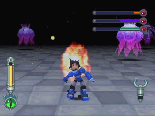
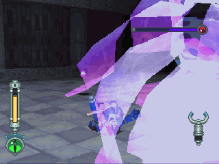
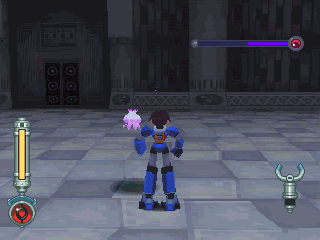
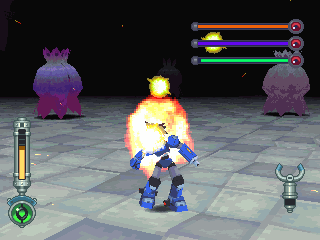
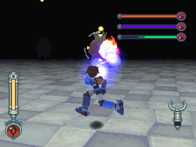
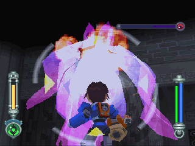

# 米德思 = ミドス = Midosu

------

## 敌方资料

DASH2 登场，尼诺岛遗迹的头目级守关者，如同水母一般晶莹的半透明身体是其特色。

在缺乏水的情况下无法移动，只会单纯放出大量追尾电球。

但是一旦到了充满水的环境就会大幅强化：

- 除了耐久力上升以外
- 也会得到高速游动的能力
- 并且在此情况下还可以放出小米德思

它们的身体具有毒性，若不慎碰到会暂时麻痹。

一定会以三只为一组的守关者，除了可以控制排水的尼诺岛遗迹，它们也出现在无法排水的基摩多玛迷宫中，在那里就得硬碰硬对付它们了。

## 攻击模式

黄色导弹的攻击。

撞击：被撞到的话会麻痹。

无限放出小米德思：只剩一个米德思时才会用的招式，碰到会麻痹，闲置一段时间后会爆炸。

到把水排掉后的情形，这样一来只会放出黄色导弹，但是射速会暴增。

## 攻略说明

新手建议在没水的情况下应战，但是要小心大量的黄色导弹。

有水的情况下，有时会突然无限时间回转防御，让玩家无法继续剧情。

若没强力特武，只要先离开房间再进来即可(但是头目 HP 会回复)。

不过有个方法可破解无限时间回转防御，就是用钻头手臂零距离攻击，血喷超快！

之后别忘了掉出来的水之钥(**记得按调查**)。

还有，后面的房间有很大的落差，非用水的浮力不可，去找开关吧！

若发生水之钥卡在地板上拿不到的情况，请先离开这个房间，再回来就可以拿到了，无须重新启动。

> 个人在玩中文正版时发生过，但就是靠此方法成功的，似乎是 PC 版才会发生的 BUG ...

如果把水排掉的话，只要一直用环形平移就赢定了。

有水的情况下，有时会无限时间回转防御，这时候得使用强力特武(推荐钻头手臂)。
