# Nino Island Mission

------

## 任务说明

本战是尼诺岛防卫战，共分 4 个部分。

入口的生命棒在右下方，黄色条。

若入口被突破，可看到市长按下自爆钮的任务失败动画...

## PART 1

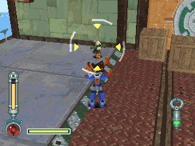

本战是要撑到时间到足以启动炮台到为止，就先攻击各个鸟霸。

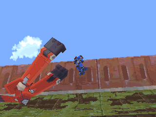

双臂人，会运送鸟霸以及丢箱子。

小心不要离它太近，不然会被抓起来重抛。

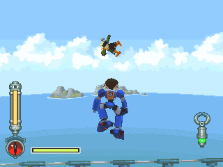

去练习一下游泳吧你！

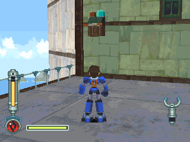

当箱子数不足时，启动左边的开关即会补给箱子。

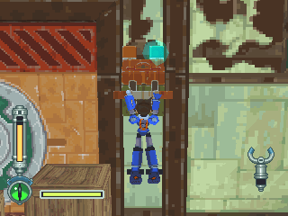

到萝露指示后，右边的开关才能启动。

之后任务就结束了，休息一下吧~

<b>备注</b>

 

此任务不难，将鸟霸解决就好，不要理双臂人。

如果很无聊，可以尝试破坏炮台，或是将钱宁丢下去。

尼诺岛战役有趣的地方多着呢 XD ~

## PART 2

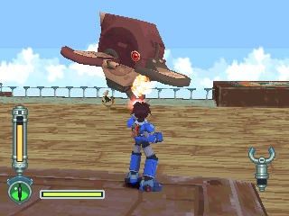

本次任务不需要理飞机。

注意鸟霸就好，死守入口即是。

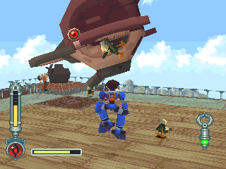

虽看鸟霸牺牲弹！效果通常不错。

<b>备注</b>

 

最简单的任务。

当鸟霸登陆时任务也差不多快结束了，而且时间到就会强制剧情，无须找开关。

## PART 3

姆弟 = ムッティ = Mutti

在 DASH2 中鲁诺尔密雅之街一战中登场的头目。

葛莱德一家的强袭上陆艇，在里面搭载超大量的鸟霸，由码头的地方准备进行强行登陆。

本体搭载的武装只有简单的机枪，但由里面跑出源源不绝的鸟霸却是一大胁威。

在战斗的后期会把意图阻挡上陆的平底锅号撞毁，不过由于游戏并没有「摔死」的设定，如果让洛克站到平底锅号上面将可让它的移动停止。

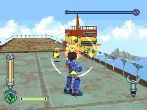

一开始，先将右侧的二个鸟霸解决。

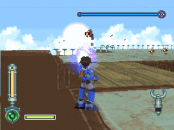

这个储存槽是可以轰掉的喔！不过用处不大就是。

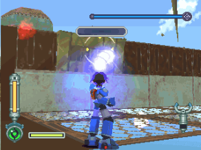

桥也可以炸掉！但这样的话姆弟就会提早移动。

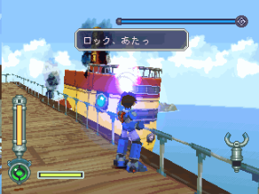

福雷德号也可轰掉...

至于对话内容，会随着击落的角色而有所不同。

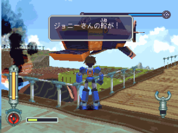

钱宁先生的船被击坠了！

不过如果洛克站在上面的话不会被击坠。

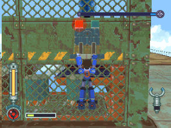

这是最后的机关，也是非常手段。

前面的平台会带出汽油弹，以进行投掷攻击。

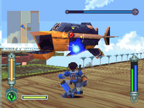

比较轻松的攻略法：使用特武(建议用摇滚地雷或加农光弹)。

即使是未改造的，也已经很好用了，要改造的话，建议先强化攻击力。

<b>备注</b>

 

尼诺岛战役最难的一次，门的耐久力太低了...

鸟霸源源不绝，令人防不胜防，不过同时也是互动对象最丰富的一关！

有二个很怪的设定：

- 就是鸟霸若掉到下面的平台，又没出现在洛克的视线，就会无故消失
- 再来是钱宁的船，因为DASH系列没有一击必杀(无底洞)这机关

所以只要一直站在上面就不会被击坠。

至于汽油弹，不把它用光是不能再补给的，要注意！

而且威力绝对比当时的洛克飞弹还强(有极限发射装置的情况例外)，要善用!

攻略流程：

1. 先把右方的二个鸟霸解决
2. 把木桥炸掉，鸟霸掉下去后会消失(？)
3. 若有鸟霸企图走铁桥，启动汽油弹开关，可叫出汽油弹又可让鸟霸消失
4. 趁姆弟尚未移动完毕时，站在钱宁先生的船上以洛克飞弹攻击(射程要够长)
5. 此时若运气好，一些鸟霸会去攻击福雷德号，降低门的威胁
6. 若钱宁的船被击坠，姆弟则会向前飞，这一段时间不会出现鸟霸
7. 用这空档狂丢汽油弹！
8. 汽油弹是最后的手段，若这样再守不住就没办法了

以上是推荐喜欢只用洛克弹的人的攻略法，如果想打得轻松一点，就用特武吧！

但前提是必须先有得到这些武器，该关推荐摇滚地雷与加农光弹，但摇滚地雷好用太多，改造费又便宜。

结论：这关的鸟霸很爱玩自杀的吗...？

## PART 4

克劳顿攻击艇指挥舰 = グライドドラッヘエース = Glyde Drache Ace

克劳顿攻击艇的队长机：

- 外型大致相同，但体积较大，涂装也略有不同
- 耐久力、攻击力方面则是大幅上升

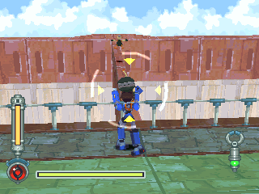

一开始要防守门口，阻止炸弹的攻击。

另外还可捡起炸弹丢回去，等时间到后 BOSS 就会出现。

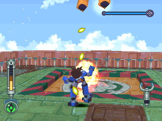

头目模式一：机关枪

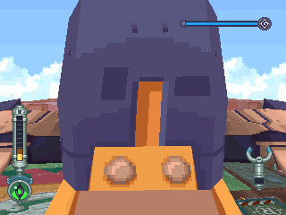

头目模式二：冲撞攻击

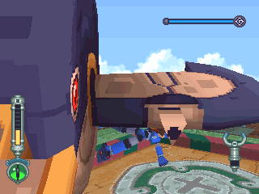

以翻滚闪躲各种攻击 ！

<b>备注</b>

 

前半段很简单，门的耐久力很高，不用担心。

就算什么事情都不做也没关系，前半段最重要的事就是保留体力。

当时间一到，克劳顿攻击艇指挥舰就会登场，距离够近再打...一会儿就赢了。

