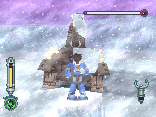
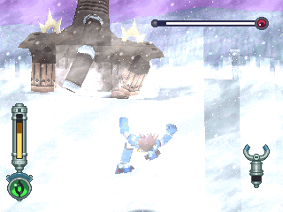
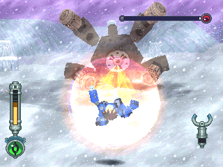
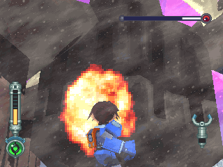
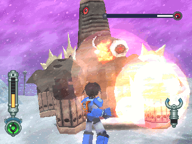

# 长毛象 = ラシマンムー = Rush Mammoo

------

## 敌方资料

在 DASH2 中登场的象型头目守关者，在禁断之地守护着赛拉的封印。

虽然体型巨大，但奔跑的爆发力十足，由鼻子可以吹出大量的雪球攻击，腹部则藏有巨大的雷射炮。

鼻子有分节的构造，在被攻击到一定程度后会一节一节爆开，雪球的命中率会因而下降。

> 命名：「巨大」+「猛玛象」

## 攻击模式

雪球攻击：攻击力很高 ！

冲击波：多半在被激怒后使出。

> 看一下左边的生命棒就知道此招有多强了

红雷射弹：HP 半减下被激怒后使出。

> 攻击力较低，但是有时会连发

## 攻略说明

游戏前半段体型最大、最强的守关者，虽然攻击模式不多，却很实用（玩家可苦了）

- 不要离他太远，雪球攻击很可怕
- 红雷射弹来不及跑开的话就用翻滚吧

锁定的位置是在稍上的位置，所以近身战时会感觉比平常大很多（有一种压迫感）

最后，祝你环形平移应用顺利！

不管怎样，被撞到总比三种的攻击损伤值来得低。

近身战法请重视！

将他自豪的鼻子轰掉！

鼻子段数越少，雪球攻击的威胁越低，但同时也会激怒他，请注意！
