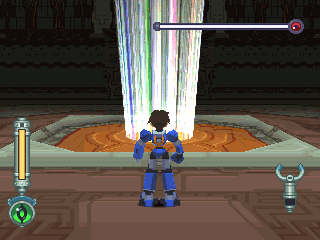
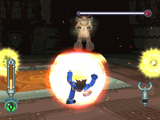
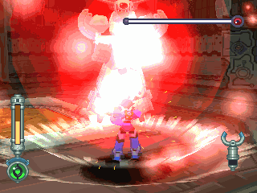
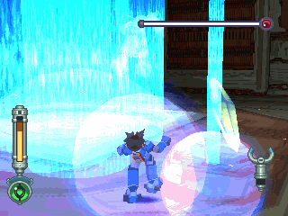
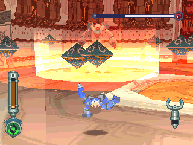
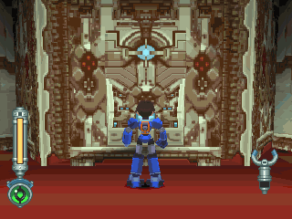
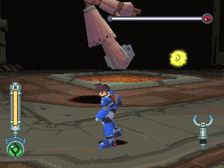
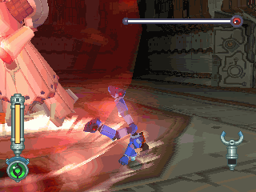
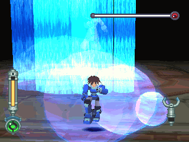
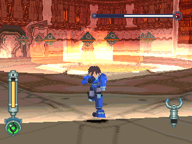

# 赛拉战斗终端机 = セラ战斗端末= SEAR BATTLE COMPUTER

------

## 敌方资料

守护天堂的主控计算机(Mother)。

对于天堂的「系统」忠实彻底的守护着，对于反抗的人完全不宽恕。

为了完成任务并守护古代人设施，坚决启动人类再生程序。

## 攻击模式

一会消失一会现身。

黄追踪能源弹击：非常难闪，但不是最难的。

防护罩撞击。

由左至右的水晶雷射攻击。

`3/4` HP后常用的大绝招：令整个房间重力变大，唤出菱形追踪弹，最后发出巨大冲击波。

## 攻略说明

未启动这个开关前都不会引发剧情，可以先到处逛逛，或回去找达它。

破解黄光追踪弹：冲到他前面去，尽量躲到他背后。

这招用翻滚就好了...

往后烙跑...翻滚失误率反而较高。

唯有这个真的很难闪，当看到房间变红后，千万不可恋战，快速离开塞拉，越远越好。

当冲击波快撞到时再跳 OR 翻滚，如果距离太近，99% 闪不掉，追踪弹之后再慢慢再打掉即可。

