# 赛拉战斗终端机最终形态 = セラ战斗端末最终形态= SEAR BATTLE COMPUTER FINAL MODE

------

## 敌方资料

坚决启动人类再生程序的赛拉，使用了最后的身体，企图与洛克一决生死。

## 攻击模式

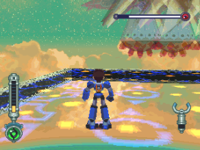

在周围快速移动。

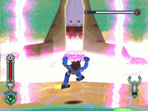

用巨大的手掌放出面状冲击波。

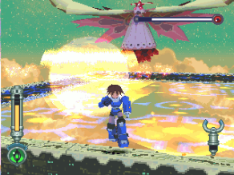

召唤流星。

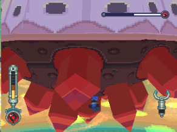

有时会突然用身体撞击。

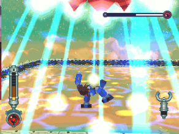

像蜘蛛网般的脚部雷射。

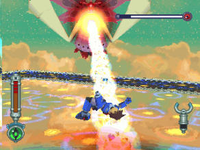

腹部雷射，非常可怕！

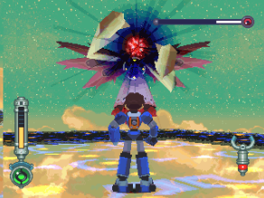

HP 减至 `3/4` 左右后常用的可怖绝招：黑洞

## 攻略说明

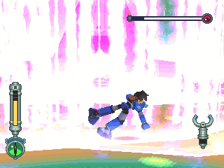

翻滚，轻轻松松破解。

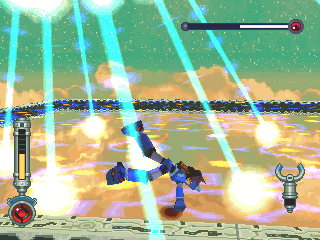

这要靠实力闪，建议绕到他背后。

因为塞拉要调头很耗时，我们可利用这点一直攻击背部。

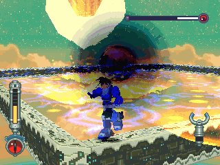

黑洞可怕的原因：

- 阻挠行动与视线
- 而且一定会跟其他招式复合使用

唯有先诱使黑洞投到较靠近角落的地方，再快速离开黑洞，准备闪躲下一招。

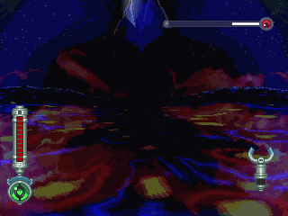

黑洞没有攻击力，但是被吸到中心时就绝对逃不出去！

在黑洞消失前，全部的招式都得硬食...

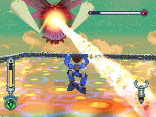

腹部镭射攻击方式有二种，先决条件是洛克的位置：

| 镭射攻击模式 | 破解方法 |
|:---|:---|
| 位置正好在发射口的正前方，这样雷射就会一直线冲过来 | 很难破解，尽量不要让这模式使出来 |
| 一边扫动一边冲过来 | 要让这个模式出现，就是要让自己的位置不在发射口的正前方，然后跑到最后面的边边，快扫到时再小跳跃(别大跳跃)。 这样一来，雷射就会往上打，这样就可以正好没被扫到。 翻滚也可以，不过有时要看情形连续翻二次 |

> 其实最终 BOSS 可以使用特殊武器 镭射枪 站桩射死，反而是最简单的 BOSS （过程中即使放黑洞也不要中断射击，硬吃伤害、以伤换杀）
