# Saul Kada Island Mission

------

## 任务说明

本战是萨尔‧卡答岛基摩多马镇解救任务，共分 4 个部分。

## PART 1

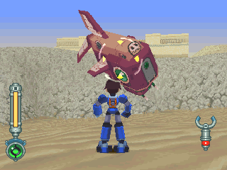

外头有时会出现多拉荷，不用理。

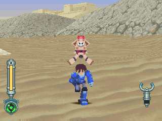

不要攻击！这家伙的爆风范围相当广。

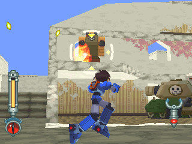

解决驻军(不理也可以)。

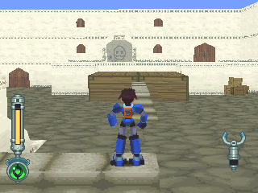

依正常路线，必须先走右门，再左门。

## PART 2

矩阵炮台 = マトリクス炮台 = Matrix Battery

彭恩一家的大型炮台，在 DASH2 中攻击基摩多玛街时登场。

由于瞄准的程序非常简易，是由哥布来操作的。

虽然单发的炮弹就有足以把任何敌人炸飞的破坏力，但由于大过庞大，在瞄准时的动作十分缓慢。

弱点是无法对太靠近自己的敌人攻击，因此藏在巷道最深处，并在周围配置小型炮台来防守。

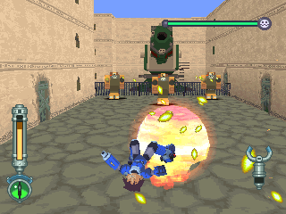

进右门后的情况，正面突破有相当的难度。

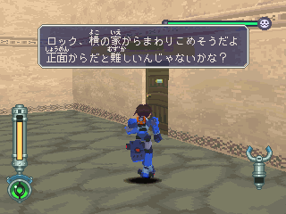

走左门吧，路上还有桶子可搜刮财物(反正以后也拿不到了)。

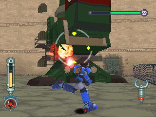

炮台的 AI 很笨，只要不站在炮门前即可安心。

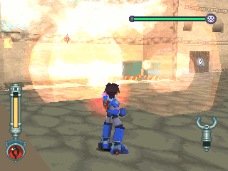

旁边有个像是放置军火的箱子。

那是可以打爆的！附赠汽油弹3桶！共约可打掉一半的 HP。

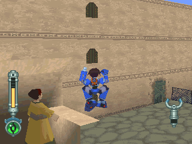

有个人在替洛克加油哩...

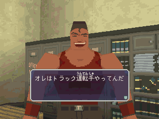

破坏炮台后，进入旁边的门。

跟这位司机讲话后，下一场战役他会帮助玩家。

## PART 3

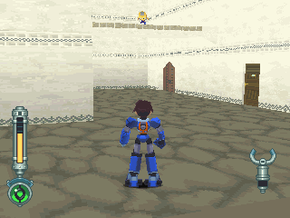

一进左门就会遇到哥布，不过他没有伤害力...

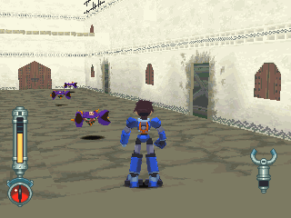

小蟹机雷，有广大的爆炸力，站远点攻击。

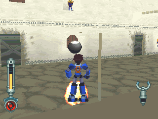

窗口的哥布会朝你丢炸弹。

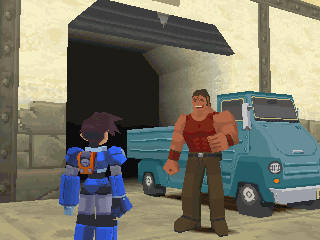

通过门后，左边可看到非常强的防卫阵容。

- 若有先进右门跟司机讲话，来到右方后司机会出现
- 若没有去找司机，就只能硬闯左边的障碍了

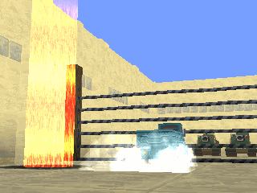

太好了！地雷与铁丝网都清除了！

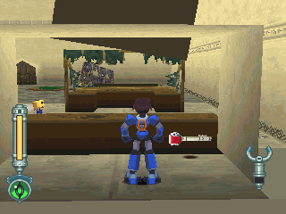

通过前一个地带后会来到居民的暂时避难所，红钥匙在某破商店内。

与布鲁斯克林克决战前，在此先休息一下吧。

## BOSS攻击模式

布里斯克林克 = ブリッツクリーク = Blitzkrieg

DASH2 中，多蓉一家侵袭基摩多玛街时，提索所驾驶的机器人。

为了让多蓉与彭取得封印之键而守在遗迹入口，不让他人进入遗迹。

为了要让前来的洛克(或其他人)有所顾惮，提索除了抢夺村民商店中的物品来丢之外，还拿了基摩多玛知名重要文化财产的大佛来当此机器的盾牌。

不过缺乏历史知识的萝露对洛克下达「把佛像破坏来攻击本体」的战斗指示，使得这一招完全失效。

> 附带一提，因为在之前的路上村民都有提到佛像是重要文物，假如真的照指示破坏佛像会使村民好感度严重下降

布里斯克林克 是一台可以变型的绿色机器人，在变型前不知为何给人一种「跪地求饶的小偷」的印象。

除了乱丢村民的商品外，还会用电磁飞盘远距离攻击。

而变身后则是能在沙地中自由潜藏移动的鲨鱼模样。

伴随着哥布钻地机的自杀攻击，它也会用利齿偷袭洛克，或者跳出沙地发射导弹。

> 命名：德语「闪电战」

 
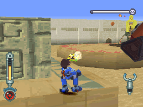

把村民的东西乱丢。

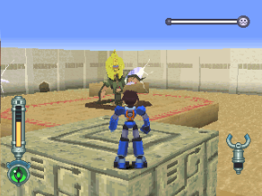

电磁飞盘：为远距离攻击。

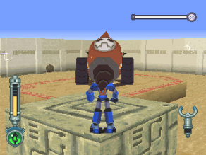

哥布钻地机的自杀攻击。

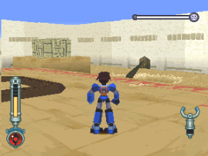

若打爆佛像，它就会潜到沙里。

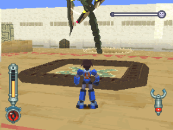

有时会跳出来。

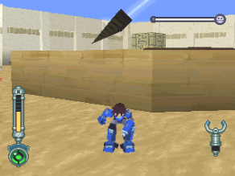

跳出来又潜下去后，发射导弹。

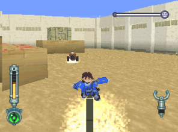

用背上的鳍撞击洛克。

## BOSS攻略说明

算是个把环形平移给封死的 BOSS。

看上去好像没有什么有效的打法，然而还有一招─移动式地雷手腕！

「详细请见 [FUN](../../11_fun.md) 页 `>` 摇滚地雷的妙用！」

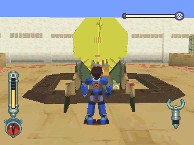

靠他太近的话，他就会用佛像当盾牌。

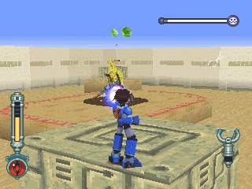

趁解除防御时，远距离攻击！

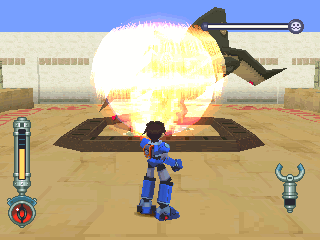

佛像要不要打爆，看各位了。

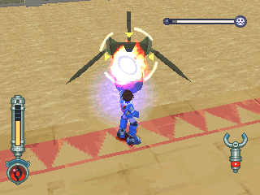

趁换气时攻击。
