# Saul Kada Ruins Mission

------

## 任务说明

本遗迹一开始不久便会遇到 BOSS 异形凯龙，但是没有血条，这时打不倒。

是要先到处解除门锁，之后来到有二个火把的房间，协助空贼阻断岩浆，之后再出去时异形凯龙会出现血条，这时就能打倒了。

## BOSS PART 1

异形凯龙 = ウォージーガイロン = Wojigairon

在萨尔‧卡答岛遗迹中出现的超巨大恐龙型守关者。

在以前有一些试图进入萨尔‧卡答岛遗迹的寻宝者都只是看到牠的身影就被吓了出来，也因此，基摩多玛镇街流传着「地底巨龙」的传说。

在有岩浆的地方可以藉由饮用岩浆来回复体力，所以是接近不死身的状态，为了要打倒它，必须阻断遗迹中岩浆的流动。

在没有岩浆的情况下，它会因为过冷而无法二足步行，也因此比较容易攻击其弱点的头部，但在此情况下却因为头部接近地面而能更猛烈的攻击。

除了由口中吐出火焰、膝盖处放出的能源追踪弹(人魂)之外，还有威力惊人的头击(实际上并不怎样，比巨汉机械王的冲击波还弱，洛克也不会倒地)。

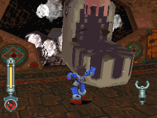

路途中有窗户可以看到异形凯龙，但若在窗边看太久的话，他会撞玩家！

> 在这里打不死他，武器再强也没用

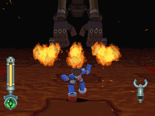

火焰弹：撞到东西后裂成小碎片。

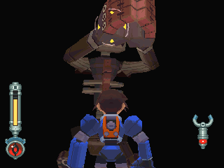

拍手：PART 2 时不会用此招

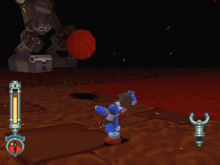

拍手后，引起震动并带有落石(随机掉落)

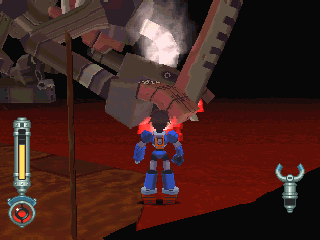

在这里打不死他，硬要攻的话，他会跑去喝岩浆补血...

## MISSION

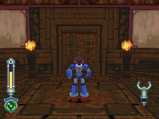

就是这里！

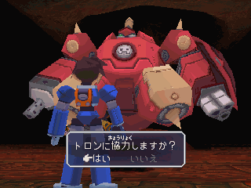

一定要答「是」

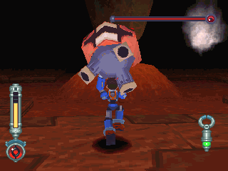

将房间四处奔跑的科尼抓起，用力向岩柱丢(要跳)

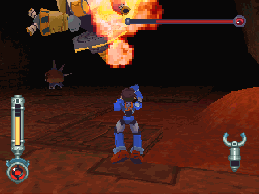

也可以打多蓉与彭，但玩得太过火的话他们可是会报复的。

另外，若要加速解决任务，方法是把科尼给打昏。

接着多蓉与彭会捡起他去打岩柱(如果他们有看到的话)。

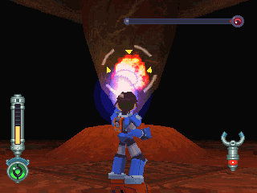

就算有极限攻击也是没用，岩柱会自动回血，乖乖的利用科尼吧！

## BOSS PART 2

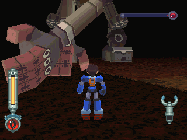

巴掌攻击：距离很近才用(根本打不到...)

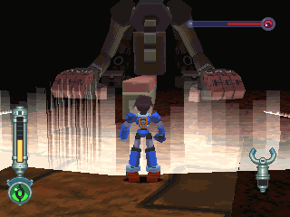

用巨大的头槌引起前方 30 度的冲击波，不过威力并没想象中的强。

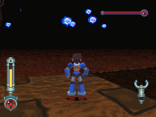

从膝盖处发出人魂，会追踪，速度慢，可打掉。

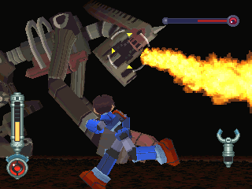

最强攻击─火焰放射：范围不大，但是被烧到的话会负伤惨重。

> 对这家伙，用环形平移是很有效的

