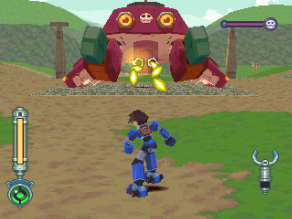
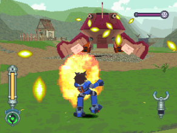
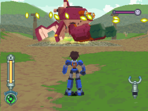
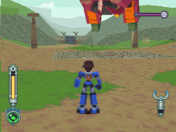
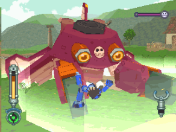
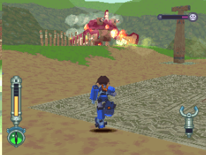
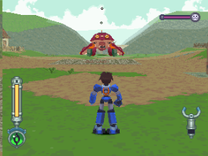
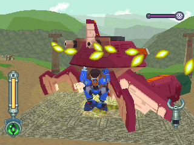
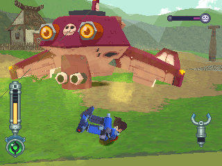

# 亚库多‧克拉贝‧改 = ヤクト．クラベ改 = Yakuto Krabbe Revision

------

## 敌方资料

多蓉所操作的螃蟹型机器人，在 DASH2 中登场。

其前型机亚库多克拉贝可在体验版中见到，主要的武器是腹部的机枪，配合机体旋转可以达成无差别的攻击，还有蟹爪部位的遥控撞击、后背部的炸弹抛掷装置等。

此外，在全速旋转时，机身将近乎无敌而可以撞击敌人造成大伤害。

「改」与前型机唯一的差别是搭载了变声器(！？)，此装置的目的是为了实行「对洛克特别作战第三号」，即模拟萝儿的声音，让洛克误以为萝儿改投敌营。

> 命名：德语「狩猎」+「螃蟹」

## 攻击模式

直线机枪击：在地上时只要被打到一次，就会连续得逞

散射机枪：无一定方向乱射，靠直觉闪吧

回转机枪击：采一上一下式发射，会瞄准洛克的位置

朝洛克的位置而跳：掉下来时并没有冲击波，放心

蟹钳冲击波：只要螯还在就会使出

疯狂战斗陀螺：HP半减后使出，附带无敌，当他浮空旋转时就要注意了

炸弹大轰炸：距离要非常远才会使出

## 攻略说明

回转机枪击实际上很好躲，只要有规律的跳就好了

战斗陀螺时，请善用翻滚，倒不如说翻滚是战斗时的利器，多加使用吧

> 如果遇到机枪击又不想费力闪，那就故意在空中受击吧(在空中受击的话接着会暂时无敌)，真正可怕的只有战斗陀螺

