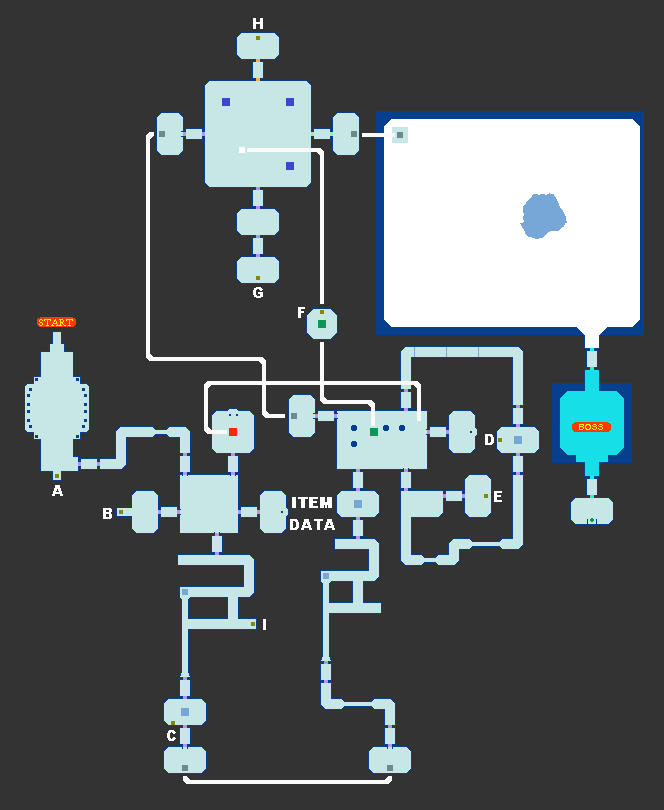

# 高岭大陆遗迹（Calinca Ruins）

道具位置：

- A 8000Z
- B 雷射枪说明书
- C 蓝色防护罩解除锁
- D 10000Z
- E 红色防护罩解除锁
- F 盾生成体
- G 能源填充SP
- H 50000Z
- I 30000Z

------

注意：

- 记得开发出防滑鞋再来啊！不然移动真的很麻烦
- 这里引用了多重构造的地板，特别是红色地板，动作不快小心掉下去
- 盾生成体几乎是这里最后才能拿到的道具
- 另外，在遇到 3 个猛玛象那边，是要引诱他们掉到洞里才能开门，方法是站在洞旁，他快撞到时再用翻滚闪避

