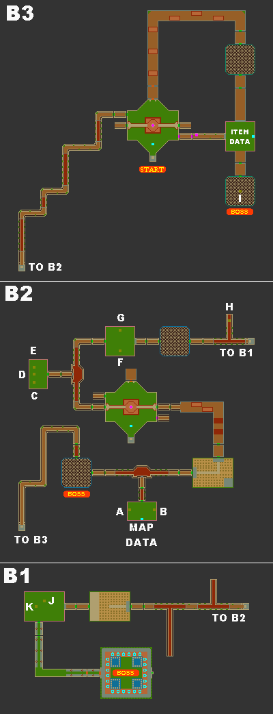

# 曼德岛遗迹（Manda Ruins）

道具位置：

- A 5000Z
- B 10000Z
- C 8000Z
- D 2000Z
- E 粗管子
- F 4000Z
- G 2000Z
- H 6000Z
- I 蓝色卡片钥匙
- J 生锈的地雷
- K 一般头盔
 

过关建议：

- 开发出钻头手臂再来吧，不然会错过一堆宝箱
- 碰到会短路的地板就几乎完蛋了，会一直被连段又跑不开
- 还有走到B2的桥时，小心掉下去...不然要重跑一趟

