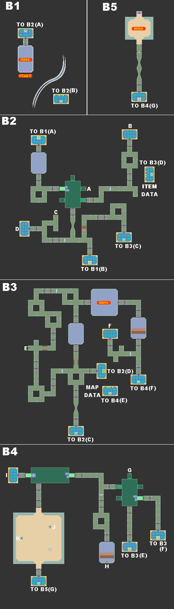

# 尼诺岛遗迹（Nino Ruins）

道具位置：

- A 2500Z
- B 12500Z
- C 5000Z
- D 开发笔记3
- E 20000Z
- F 强力芯片
- G 4000Z
- H 强射程零件
- I 播种机
- J 20000Z
- K 水之钥2
 

攻略提示：

- 水迷宫永远是 DASH2 最麻烦的一关，必须不断地到各楼层启动注水以及排水
- 钻头手臂也很重要
- 水之钥1 在打倒三位米德思后才会看到
- 另在拿取 水之钥2 的房间有个很大的守关者，但没有敌意，可站到他背上以拿取 水之钥2；但是如果攻击他，他会反击，而攻击太多次的话会让他暂时不动，不过离开这房间再回来的话便会回归正常

