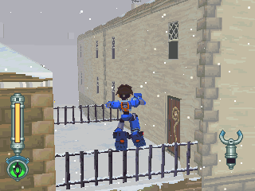
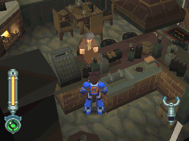
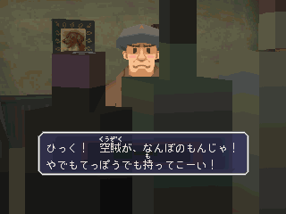
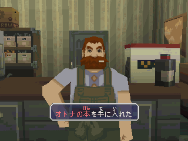
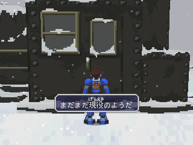

# 杨绍卡镇

杨绍卡镇进入后便往左走，可看到二扇门

左边那个是通往酒吧

他会误以为洛克是本地人，因此谈话会有变化(随剧情进行而改变)

右门是进入组装店：

- 与老板一段嗳味对话后选"是"
- 可得到「成人书=オトナの本」

- 对着火车驾驶座(限靠近车站那一侧)调查，便可听到火车汽笛，很大声喔
- 不过调查判定很小，请正对着驾驶座调查

> 在空贼列车联合事件后便无法再触发此要素

