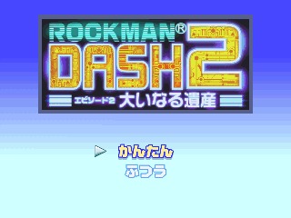
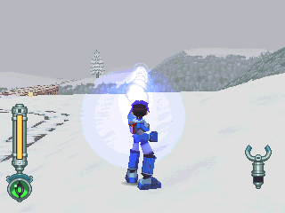
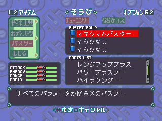
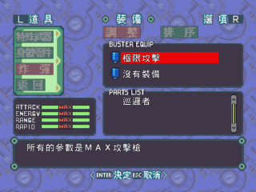

# 难度选择

破关后再选择游戏开始，便有难度选择：

- 简单=かんたん： 破关后便可选择，持 C 级执照；敌方变弱，掉出金额变二倍；一开始生命棒便最高，且有极限攻击
- 一般=ふつう： 跟平常相同，持 B 级执照
- 困难=むずかしい： 至少 A 级执照情况下全破；持 S 级执照，敌人与 S 级执照情况下相同
- 麻烦=しんどい： S 级执照情况下全破；持 SS 级执照，敌人与 S 级执照情况下相同；但是武器攻击力以及敌方掉出金额减半

计算机版执照问题：

- 无 C 级执照，简单-B，一般-A，困难-S，麻烦-SS
- 正确来讲应该修正成：简单-C，一般-B，困难-S，麻烦-SS

这就是间单模式下才有的极限攻击

威力超群！

计算机版也是有极限攻击，不过需下载更新档，但是没解决执照问题...

> 载点在这里：[dash2 中文计算机版更新文件](./dash2.zip)
