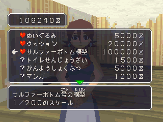
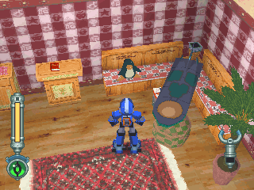

# 洛克购买家具&礼物事件

------

杂货店的这些东西都是用来提升萝露好感度用的，购买后便会在对应区域出现

至于有心形标志的道具都在萝露房

------

心形道具如下：

- 布娃娃 = ぬいぐるみ：椅子上
- 抱枕 = クッション：不见了(详细请看萝露的日记)
- 塞尔法飞行船模型 = サルファーボトム模型：天花板

问号道具如下：

- 壁纸 = かべ纸：萝露房
- 观叶植物 = かんようしょこぶつ：萝露房
- 漫画 = マンガ：洛克房
- 电玩 = テレビゲーム：洛克房
- 水墨画 = すいぼくが：巴雷尔房
- 壶 = シボ：巴雷尔房
- 厕所清洁剂 = トイレせんじょうざい：厕所(调查马桶可知变干净了)

