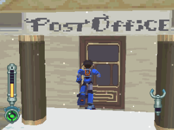
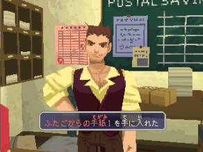
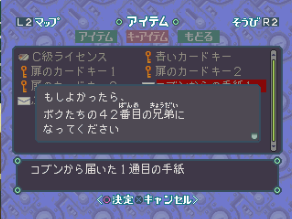
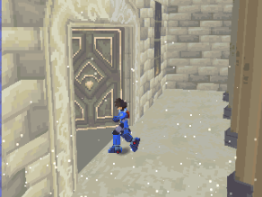
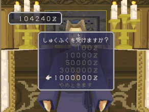
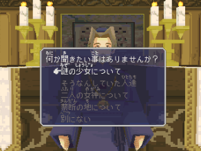
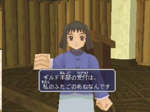

# 杨绍卡镇─雪之街

------

进入镇上后，右方便是邮局

接收信件

之后，要打开特殊道具栏才能阅读：

- 哥布的信1：波古德村中打倒多蓉后
- 哥布的信2：萨尔‧卡答岛遗迹过关后

以下的信在把全部的读书工具交给畿豆村的少女优，再符合以下条件即可收到：

- 孩子的信1：福雷德号移动 3 回后
- 孩子的信2：福雷德号移动 6 回后
- 孩子的信3：福雷德号移动 9 回后

> 在同一区域起飞降落则不算数

镇上最内部便是教会

与神父说话后便可捐钱，其实这是快速提升好感度的方法

> 数值请到 [ITEM & DATA](../../07_item_data.md) 页查看

之后，可打听游戏内的一些情报（会随着游戏的进行而增加项目）

与左手边的女性交谈，便可开始执照考试

