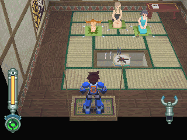
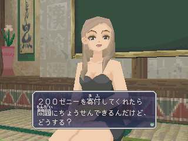
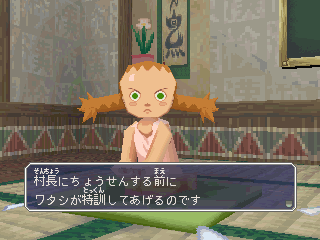
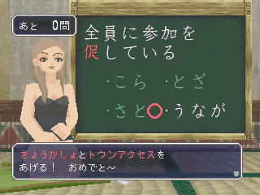
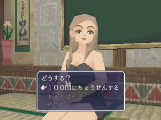
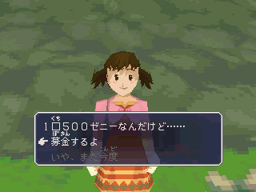

# 曼德岛─波古德村

------

与多蓉对决后，可来到村长家，但此时一个人都没有。

必须要进入遗迹并且下去后，触发空贼 BB 兄弟登场动画，之后再回来，便可进行汉检

之前村子若有毁坏，则以挑战汉检的金额来充作重建费

> 请看下方栏中的详细说明

可先与二位弟子挑战汉检，每次10问，全对的话可获得奖品

> 一个弟子共可拿 4 个奖品

村子重建好后挑战村长的话，是 100Z，10 问

若前一次村长的汉检挑战成功的话，之后村长会提到传说中的宝物：

看看玩家要挑战 100 问，还是付出 2000000Z

另外，与村中的这小女孩持续谈话后，她会问你要不要捐 500 元？

这也是个复兴村落的方法(可重复捐直到钱足够为止)

------

重建一户需 2000Z，重建顺序为：左上杂货屋 `->` 右下组装店 `->` 左下民家 `->` 右下民家

汉检挑战弟子1获得奖品：

1. 笔记本 = ノート
2. 波古德茶 = ポクテ茶
3. 茶杯 = ゆのみ
4. 波古德馒头 = ポクテまんじゅう

汉检挑战弟子2获得奖品：

1. 铅笔 = えんぴつ
2. 干芋 = ほしいも
3. 没吃完的巧克力 = 食べかけチョコ
4. 奇特的果汁 = 変なシュース

汉检初次挑战村长获得奖品：

1. 教科书 = きょうかしょ
2. 通用控制芯片 = トウンアクセス

